# Physical Verification using SKY130


A 5 day cloud based virtual training workshop conducted by VSD-IAT from 11<sup>th</sup> to 15<sup>th</sup> August. The link to the workshop webpage can be found [here](https://www.vlsisystemdesign.com/physical-verification-using-sky130/). Below is a brief, day-wise documentation about the topics covered in the course, along with my implementations of the lab sessions.

## Table of Contents


## Day 1 - Introduction to SkyWater SKY130 and Open-Source EDA Tools

### SkyWater PDK

The SkyWater Open Source PDK is a joint project between Google and the SkyWater Technology Foundry, which provides a fully open source Process Design Kit (PDK), and its related resources. The SkyWater open PDK public repository contains the following:
 - [Documentation](https://skywater-pdk.rtfd.io/) 
 - [PDK Library and files](https://github.com/google/skywater-pdk)
 - as well as the [Community](https://join.skywater.tools/)
 
 
 
The "130" in SKY130 stands for the feature size, which is the length of smallest transistor that can be manufactured in the process.

### Open-Source EDA Tools

Open_PDKs is a Makefile based installer that takes files from the SkyWater PDKs and reformats them for a number of open source EDA tools, which can be found at [R. Timothy Edwards' github page](https://github.com/RTimothyEdwards/open_pdks).

Tools currently supported by open_pdks:
- Magic
- Klayout
- Openlane
- Xschem
- Netgen
- Ngspice
- IVerilog
- qflow
- IRSIM
- xcircuit

To install SKY130 PDKs, we must clone the repository and specify the process to compile and install using the following commands.

```
git clone https://github.com/RTimothyEdwards/open_pdks
cd open_pdks
configure --enable-sky130-pdk
make
sudo make install
```

The ```make``` process grabs the SKY130 repository and submodules, as well as a few third party repositories to use in the install. It then builds the libraries from these various repositories.

The libraries supported by open_pdks are:
- Digital standard cells (ex: sky130_fd_sc_hd)
- Primitive devices/analog (ex: sky130_fd_pr)
- I/O cells (ex: sky130_fd_io)
- 3rd party libraries (ex: sky130_ml_xx_hd)

Open_PDKs uses a common installed filesystem structure, where the SkyWater PDKs are placed under the directory ```/usr/share/pdk/sky130A/```. Under this main SK130 PDK directory, are 2 subdirectories ```libs.tech```, which contains all subdirectories for the open source tool setups, and ```libs.ref```, which contains the reference libraries in various formats. The project directory follows a similar format, with a ```project_root/``` directory containing subdirectories for each tool or flow needed.

### Physical Verification and Design Flows

Like functional verification, where we check if the voltages, signals and timings match the specification; physical verification is to check whether you have a mask layout that matches what you think the circuit should be.

### Lab - Checking Tool Installations

1. Magic: It can be run by giving the command ```magic``` in the command line interface. This brings up a layout window and a console window that is a stock tcl interpretor used to run commands for layout and actions. We can get the tcl interpretor in the terminal itself instead of the seperate console window by using the option ```magic -noconsole```. Magic can also be run without the graphics layout window using the option ```magic -dnull - noconsole```, and should be called as such when running from a script. To run magic in batch mode, we use the command ```magic -dnull -noconsole filename.tcl```.

2. Netgen: We can run Netgen using the command ```netgen``` in the terminal. It is completely command driven and has no graphics interface. Its console window is a stock tcl interpretor like magic as well. We can get the tcl interpretor in the terminal itself instead of the seperate console window by using the option ```netgen -noconsole```. To run netgen in batch mode, we use the command ```netgen -batch source filename.tcl```. Netgen also provides a GUI window written in python that can be accessed using ```usr/local/lib/netgen/pyhton/lvs_manager.py```, though this interface hides many useful options that cannot be accessed with just this window itself.

3. Xschem: It is accessed using the command ```xschem``` in the terminal. This should bring up a schematics window. Unlike netgen and magic however, xschem has no seperate console window and uses the native command line terminal for tcl commands. Xschem can be run in batch mode with the command ```xschem --tcl filename.tcl -q```.

4. Ngspice: It can be run using the command ```ngspice``` in the linux command line. Ngspice has its own prompt and runs its own set of interpretor commands that aren't based on tcl. It can be run in batch mode using the option ```ngspice -b```.

Let's get acquainted with these open source tools with a basic example of an inverter design. First, we must create a directory for the design and initialise subdirectories for each of the open source tools that we will be using. This is shown below.

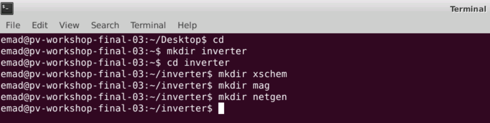

Next, we must set up each directory for its respective tool to run properly with the SkyWater PDKs. This can be done by creating a symbolic link between the just initialised subdirectories and the SKY130 submodules created with the open_pdks installer. This is done using ```ln -s /file_path``` in the desired subdirectory, and is shown below. As we will run ngspice simulations using xschem, so we setup ngspice under the xschem subdirectory itself.

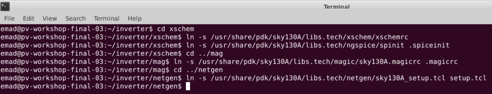

Let us run Xschem using the command ```xschem```. This brings up a display for xschem with a lot of example schematics, introducing you to SKY130 devices as seen below. Examples can be accessed by clicking the relevant rectangle and pressing the E key on the keyboard. We can return to the menu by pressing CTRL+E. The F key resizes the schematic to fit the window.

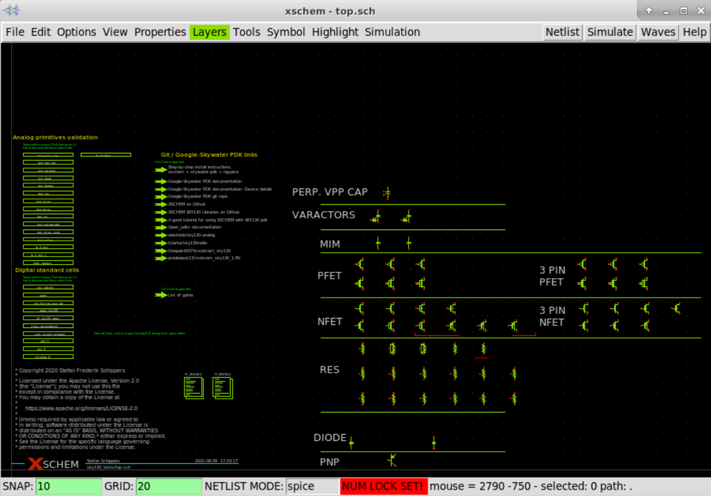

Now, we can check the magic installation using the command ```magic``` in the /mag subdirectory. This should bring up the 2 magic windows, with the layout window displaying "Technology: sky130A", along with many colors and icons displaying the available layers in this technology, as show below.

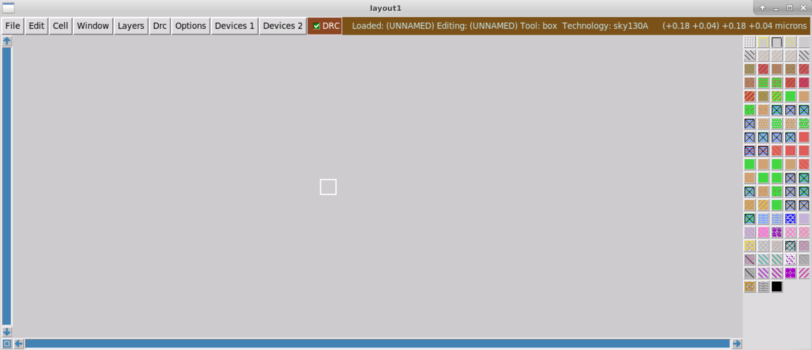

We can use the command ```magic -d XR``` to invoke a cairo graphics package which uses 3D acceleration to get better rendering than the default graphics. There is also an OpenGL based graphics package that can be accessed using ```magic -d -OGL```. 

Useful Magic Shortcuts:
1. Left and right mouse buttons to adjust the cursor box
2. Shift+Z to zoom out
3. Middle mouse button/P to select a layer (also known as painting)
4. E to erase whatever is present in the cursor box (can also be done ny clicking the middle mouse button on an empty part of the layout)
5. V can be used to view the entire layout
6. CTRL+P opens up the parameter options for the selected device
7. S key can be used to select layers
8. Typing the ```what``` command in the magic console gives information on the selected layer
9. ; key can be used to type commands in the magic console without moving between windows, until the Enter key is pressed
10. I key can be used to select a device, and M key is used to move them

The purple layer "metal1" below shall be most used to connect devices in further lab experiments.

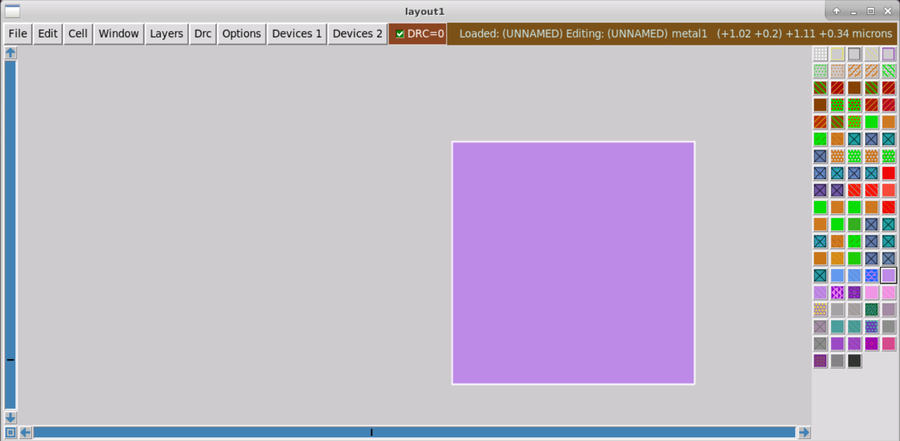

We can create some devices using the two Devices drop down buttons. Let us select the nmos (mosfet) under "Devices 1" and set the width to 2 um, length to 0.5 um and fingers to 3. This should result in the following device being created.

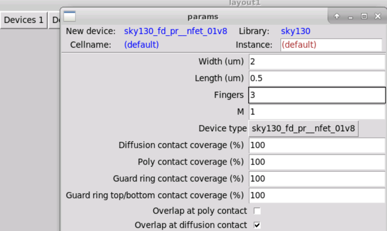

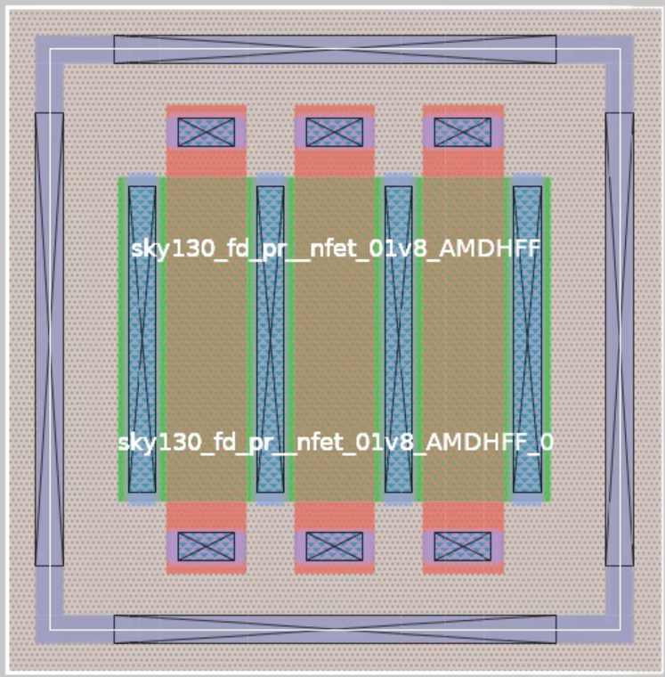

### Lab - Creating an Inverter Design

Let's run xschem and open a new schematic under the File option. To add a component we use the Ins key. Select the SkyWater library directory path to access SkyWater components and choose the fd_pr library. To create an inverter, we need a basic nfet and pfet. So let's select a nfet and pfet device from the insert window and place it anywhere in the schematic. 

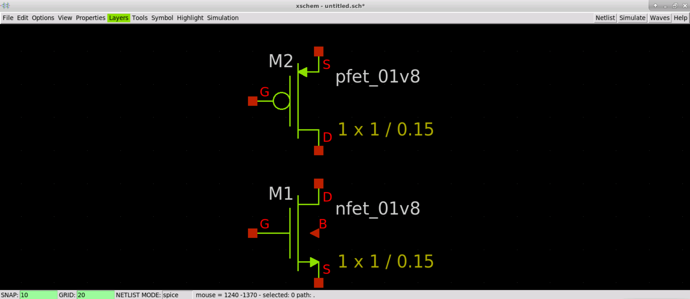

As we want to turn the schematic to a layout, it is good practice to keep the circuit parts that will be turned into a layout self-contained so it doesn't have any unnecessary components in it that do not need to be present in the layout. It is also good practice not to use any specific power supply pins as there is no concept of a global supply pin/net in a layout. Not adhering to these practices can cause problems later when verifying layouts.

As pins are not PDK specific, they can be found under the xschem library in the insert window. These are named as ipin.sym, opin.sym and iopin.sym. We can place the pins and use the M key after hovering the component to move them around on the schematic window. The C key can be used to copy components. Similarly, the Del key can be use to erase components. Now, we can make use of the W key to insert wires between components and make connections. Next, we should rename each pin to something sensible using the Q key to bring up the parameter window.

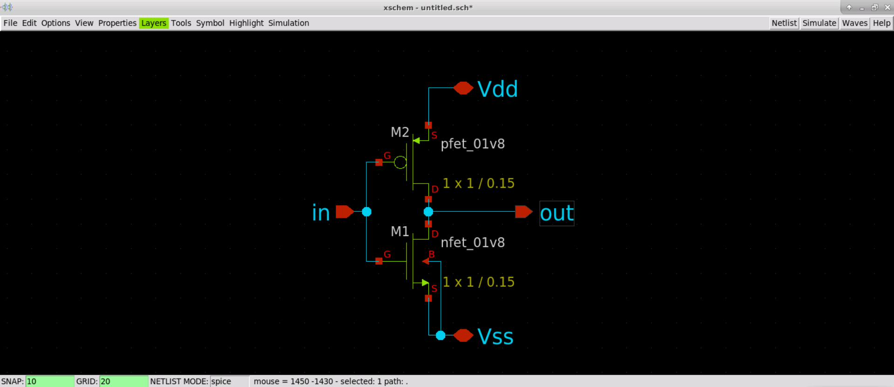

To configure the properties of the devices, we can select them by clicking on them and bringing up the parameter window with the Q key. We change the length in the parameter window to 0.18 as the default value of 0.15 is restricted to sram devices only. We can set the number of fingers to 3, and the width of each finger to 1.5. As we have 3 fingers however, the total width in the parameter window must be set to 3 times of the finger width, which is 4.5. The other parameters are PDK specific so it is best not to alter them unnecessarily.

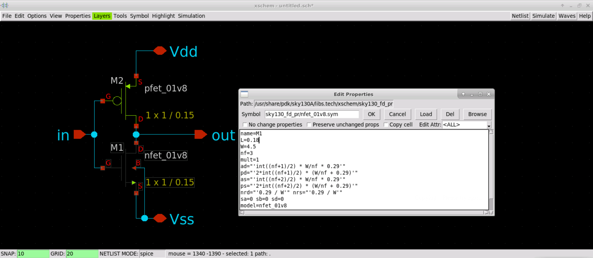

Similarly, we can adjust the parameters of the pfet to 3 fingers, width of 1 per finger, and a length of 0.18. We must specify the body to be connected to the Vdd pin as it is a 3 pin pfet.


Now, we have a valid schematic for a basic inverter. We can save this using "Save as" and saving it under the local user directory and renaming it to a suitable name.

To functionally validate the schematic, we must create a testbench that is seperate from the schematic. First, we create a symbol for the schematic, as the schematic will appear as a symbol in the testbench. To do this, we click on the Symbol menu and select "Make symbol from schematic". Now, we can create a testbench schematic using the new schematic option and insert the generated symbol from the local directory using the Ins key.

The testbench will be very simple. We will generate a ramp input and watch the output response after connecting the power supplies. To do this, we can insert 2 voltage sources from the default xschem library, one ofr the input and one for the supply. We can connect these and add a GND node to the supply connections. Next, we must create "opins" for the input and ouput signals that we want to see in Ngspice. If done correctly, we should get the following.

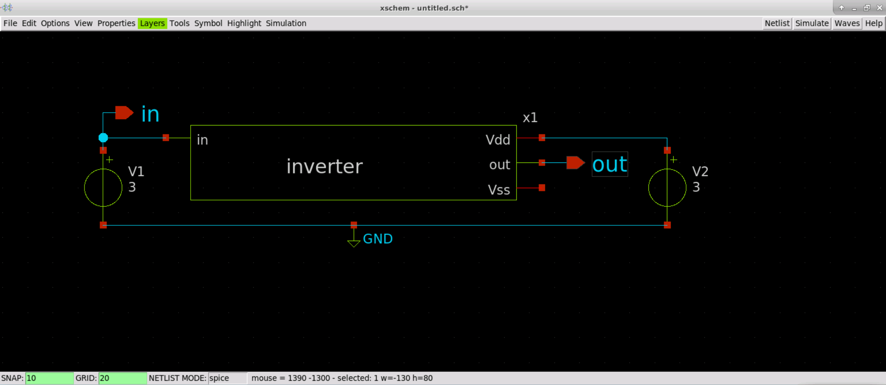

Next, we set the values for the voltages. The supply voltage is set to 1.8v. For the input voltage, we must set the supply to a piece-wise linear function to get ramp like behaviour as follows.

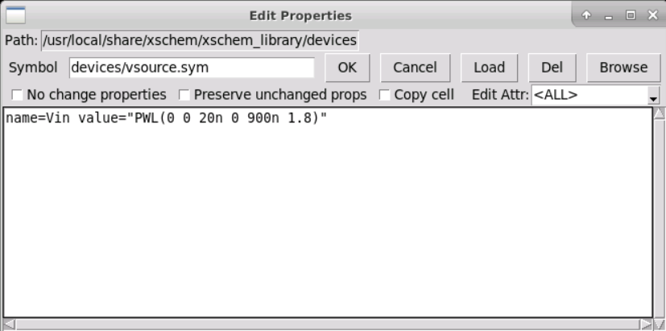

Here, the PWL function has voltage and time values that state that the supply will start at 0v, then start to ramp up from 20 ns till it reaches its final value at 900 ns of 1.8v. Next, we must place two more statements for ngspice, but as these arent specific to any component, they must be placed in text boxes. To place a text box, we select the code_shown.sym component under the xschem library.

The first one will specify the location of the device models used in the device schematic. We will use a .lib statement that selects a top level file that tells ngspice where to find all the models and also specifying a simulation corner for all the models. We shall use the typical corner with ```value = ".lib /usr/share/pdk/sky130A/libs.tech/ngspice/sky130.lib.spice tt"```. For the second block, we shall use the statement as follows.

```value = ".control
tran 1n 1u
plot V(in) V(out)
.endc"
```

This will tell ngspice to run a transient simulation for 1 ns and monitor voltages for the in and out pins. Finally, we should get the completed testbench schematic as follows, and save this as inverter_tb.sch.

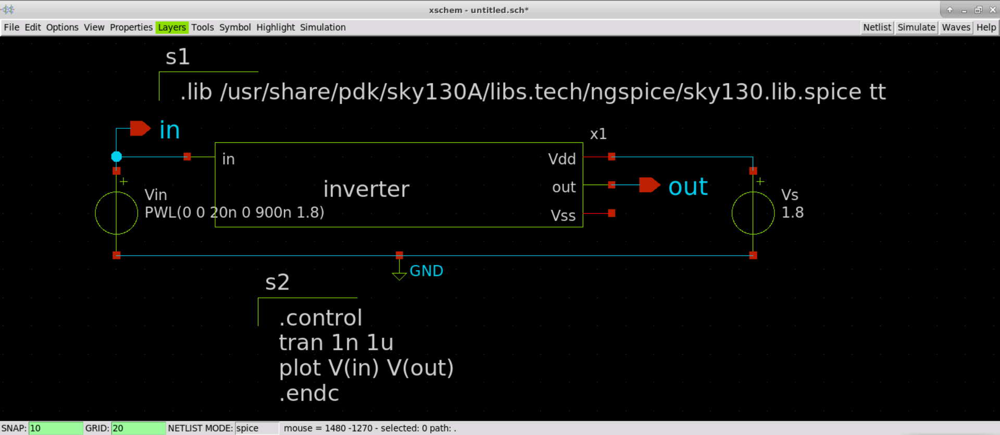

To generate the netlist we can click on the Netlist button, then we can simulate it in Ngspice by clicking the Simulate button. We should get the following waveform, which confirms that our schematic behaves as an inverter.

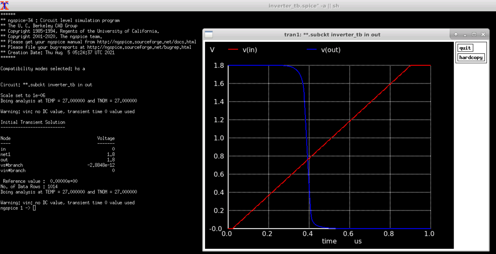

Now that we have functionally verified our schematic, we can proceed to create a layout for it. To do this we must go back to our inverter schematic. first, we must ensure that we click on the Simulation menu and select the "LVS netlist: Top Lvel is a .subckt" option. We wait a few seconds and go back to the Simulation menu to check wheter a tick mark appears beside the aforementioned option. This verifies if we have properly defined a sub circuit for creating a layout cell with pins in the layout. Finally, we generate a netlist for the schematic by clicking the Netlist button and exit Xschem.

Now we can import the scehmatic to the layout in Magic. First we run magic, then click on File > Import SPICE and then select the inverter.spice file from the xschem directory. If done correctly, we should see the followinf layout open up in magic.

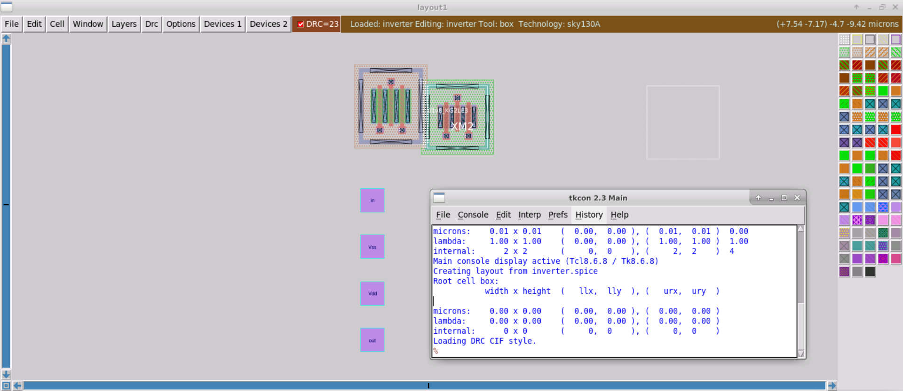

As you can see, the schematic import does not know how to do analog place and route as it is very complicated. We must place them in the best positions and wire them up manually. First, we can start by palcing the pfet device above the nfet and adjusting the placement of the input, ouput and supply pins. We should get the following.

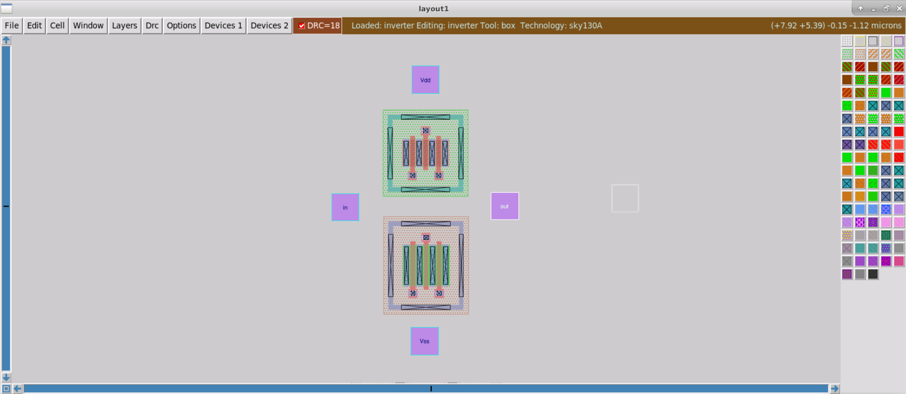

Next, we must set some parameters that are only adjustable in the layout which will make it more convenient to wire the whole layout up. First, we set the "Top guard ring via coverage" to 100. This will put a local interconnect to metal1 via ta the top of the guard ring. Next, for "Source via coverage" put +40 and for "Drain via coverage" put -40. This will split the source drain contacts, amking it easy to connect them with a wire. For the nfet, we set the "Bottom guard ring via coverage" to 100, while the source and drain via coverages are set to +40 and -40, respectively, like the pfet.

Now, we can start to paint the wires using metal1 layers. First, we connect the source of the pfet to Vdd and source of the nfet to Vss. Next, we connect the drains of both mosfets to the output. Finally, the input is connected to all the poly contacts of the gate. Now, we should get something as shown below.

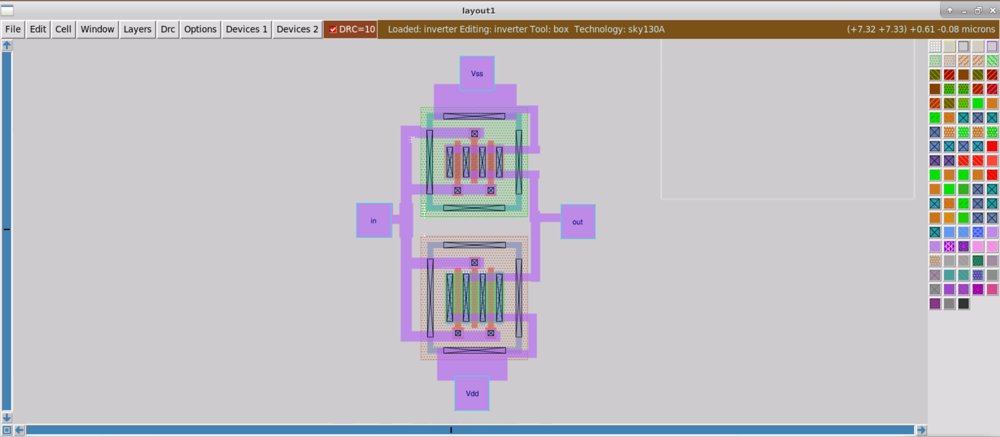

Now, we can sav the file and select the autowrite option. Then we run the following commands in the magic console.

```
extract do local
extract all
```

The first command ensures that magic writes all results to the local directory. The second command does the actual extraction. As the output is in magics own format, but we want to simulate the netlist in spice, so we use the command ```ext2spice lvs``` which sets up the netlist to heirarchical spice output in ngspice format with no parasitic components which is good for simulation but not for running lvs. Next, we run the command ```ext2spice``` which generates the spice netlist. Now we can quite magic.

To run LVS, we can first clear any unwanted files from the mag subdirectory. The .ext files are just intermediate results from the extraction and can be removed using the command ```rm *.ext``` if needed. We can also clean up extra .mag files using the command ```/usr/share/pdk/bin/cleanup_unref.py -remove .```, which were any paramaterised cells that were created and saved but not used in the design.

Now we can run LVS by entering the netgen subdirectory and using the command ```netgen -batch lvs "../mag/inverter.spice inverter" "../xschem/inverter.spice inverter"```. Remember to always use the layout netlist first and schematic netlist second as then in the side by side result the layout is on the left and the schematic is on the right. Each netlist is represented by a pair of keywords in quotes, where the first is the location of the netlist file and the second is the name of the subcircuit to compare. As we can see from the result below, there was an issue in the wiring and the netlists do not match. This is due to wiring errors in the layout.

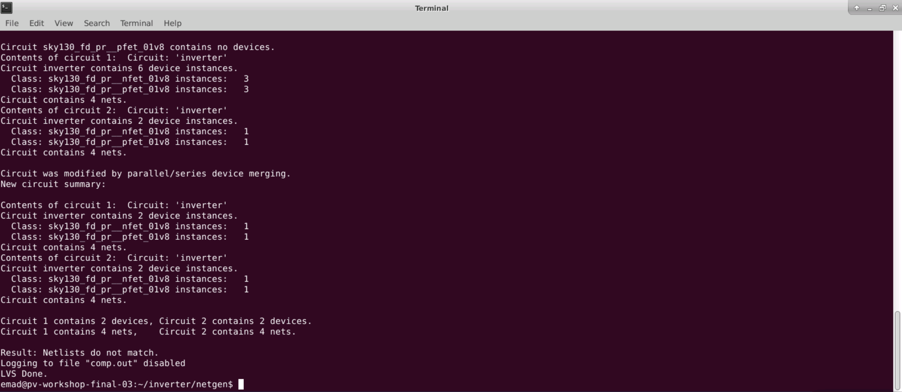

If the layout is correct, the last step would be to validate the layout netlist again with parasitics included. We can include both resistive and capacitive parasitics in magic netlists, though this process is complicated and requires manual interventions, excluding it from the scope of this exercise. Capacitive parasitics can be easily included though, by using the following commands in the magic console window during extraction.

```
extract do local
extract all
ext2spice lvs
ext2spice cthresh 0
ext2spice
```

Here, the command ```ext2spice cthresh 0``` tells magic to add all the parasitic capacitances to the spice netlist. If we now view the netlist file in an editor, we can see multiple lines beginning with C, which detail the parasitic capacitances.

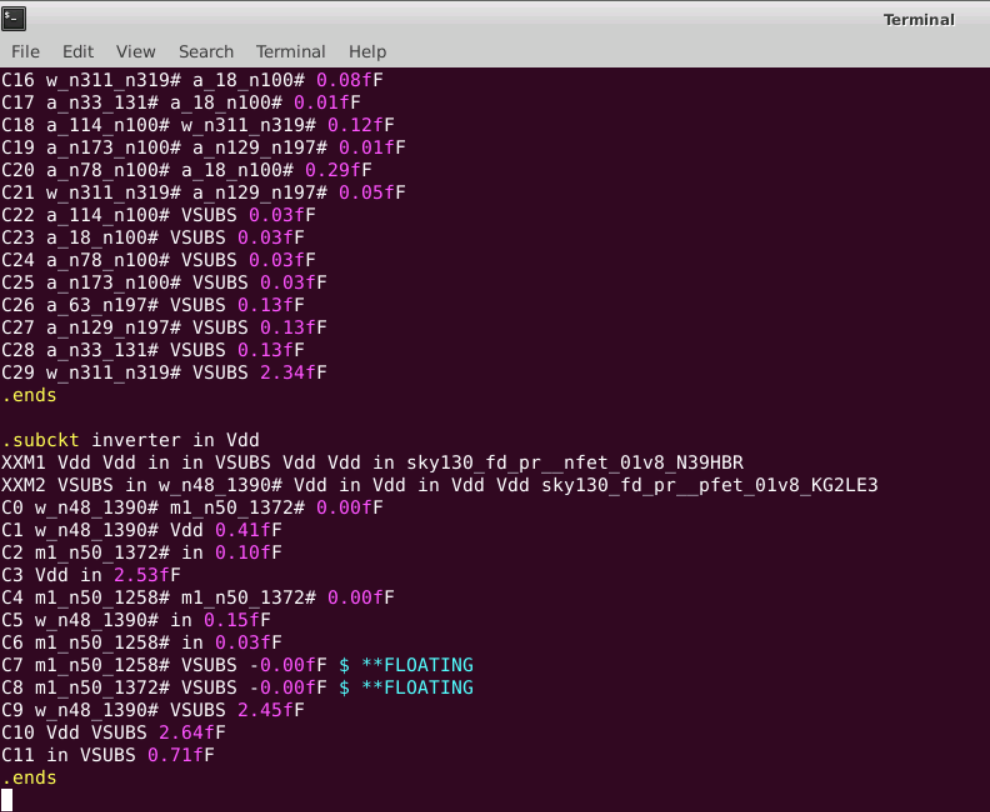

By ordering the original testbench pin layout according to the new netlist, and replacing the old subcircuit definition, we can run an ngspice simulation on the layout netlist with parasitic capacitances included. Though, the waveform should not change much.

## Day 2 - Design Rule Checks and Layout Vs. Simulation

### Fundamentals of Physical Verification

As chips get denser, the scale of physical verification increases. While chip designs can be hierarchical, physical verification is not. The two primary aspects of physical verification are as follows:

1. Design Rule Checks (DRC)
 * Ensures that the design layout meets all the silicon foundry rules for mask making
2. Layout vs. Schematic (LVS)
 * Makes sure that the design layout electrically matches the design, as implemented in schematic form or any form that electrically describes the design spec

While initially physical verification was conducted from independent sources, and more the independent sources, the better. Nowadays, in the age of automation, wherein chips are designed from a single source (RTL design), the LVS process is now about checking the design through different flows; one starting at the RTL source and working forwards, while the second starting at the finished layout and working backwards. This way the tools used cross check each other.

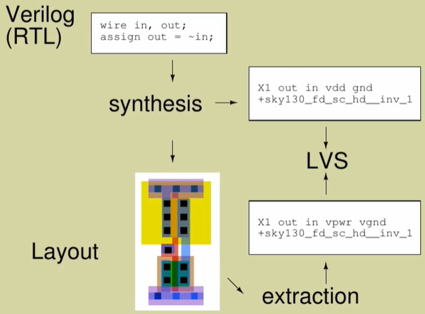

Even though the chip design process is automated, there are still points where manual intervention occurs, and physical verification must check that any manual intervention hasn't broken something. Though, mostly in case of errors we look for how the tool got it wrong and how we can modify the setups to overcome the problem. Increasing the number of tools used, increases the robustness of the physical verification process. 

### Data Formats and GDSII

For some form of standardisation to describe integrated circuits, a standard file format is needed. These forats must describe both data (rectangles, subcells, polygons) and metadata (labels, cell boundaries and instance names, etc.) regarding IC layouts. 

Some common file formats are:
-  Caltech Intermediate form (.cif)
-  GDSII stream format
-  Open Artwork System Interchange Standard (OASIS)

The GDSII format is now the industry standard accross foundries for representing IC layouts. what distinguishes GDS from other formats are its layer:purpose pairs. Instead of describing each layer with a name such as DIFF for diffusion, it describes them as a pair of numbers, seperated by a colon (ex. 65:20). Here, one number denotes the layer (such as diffusion, metal1, poly), while the other number denotes the purpose (such as blockage, net, drawing, label, pin, ,etc.). Though, layer:purpose pairs may be inconsistent accross foundries. More on the GDSII format can be found [here](https://boolean.klaasholwerda.nl/interface/bnf/gdsformat.html).

>Note: Since most of these file formats do not describe all metadata (such as pin use/class, device types), it is very common to lose some of your metadata after writing out a full chip to gds.

### Extraction Styles and Options in Magic

The layout tool needs to be able to independently generate a netlist by looking at nothing other than the mask geometry of the layout. This process is known as Extraction. Extraction in Magic is a two stage process, wherein magic generates an intermediate netlist format called the .ext, after which it is converted to the required netlist format such as spice.


All devices, instances, connections between cells, subcells, nets, as well as parasitics are present in the netlist. This netlist can be fed to a simulator such as Ngspice, along with a schematic captured netlist to compare the results of the two. 

Even though magic can create a netlist for simulation, it has no idea how to actually simulate the netlist. To simulate a netlist from a layout, we must provide all the missing information. This includes the testbench netlist, along with the necessary stimuli for simulation. As the layout editor knows nothing about the actual device models, we need to use include statements to add all device models used in the layout. A subcircuit netlist is this generated netlist from the layout editor, and must be included as well. Finally, an analysis control block is needed to tell the simulator what kind of simulation to run as well as its simulation parameters.

There are three extraction styles available in magic: ngspice(), ngspice(orig) and ngspice(si); and can be selected using the commands below.

```
extract style ngspice()
extract style ngspice(orig)
extract style ngspice(si)
```

Some extraction options in magic are as follows.

```
ext2spice lvs
ext2spice cthresh value
ext2spice scale on|off
ext2spice hierarchy on|off
ext2spice subcircuit top on|off
ext2spice global on|off
ext2spicemerge on|off
```

>Note: Magic also stores layer heights/thicknesses, and a three dimensional view of the layout can be rendered by magic's 3D engine using th menu button Option > 3D Display.

### GDS Reading and Writing in Magic

GDS files can be accessed in Magic with the ```gds``` command. To read a GDS file in magic, we use ```gds read file_name```. Some important read options ofr gds files in magic are listed below.

```
gds readonly true|false  //Allows ceratin cells to be read-only, preventing magic from changing their gds descriptions in the final output gds file
gds flatglob expression  //Flattens cells in question to be merged up into the hierarchy above them, preventing unnecessary heierarchy in the layout
gds flatten true
gds noduplicates true    //Tells magic to ignore cell definitions in gds files that it already has in memory
```

GDS files can be written in magic using the command ```gds write file_name```, and some of its options are listed below.

```
gds library true      //Used to create gds library files with subcells with no concept of a top level layout
gds addendum true     //Ignores read-only cell definitions when it generates an output
gds merge true|false  //Turns rectangles and triangles present in the design into merged polygons for easier viewing
```

### DRC Rules in Magic

Magic implements an interactive DRC, wherein it shows DRC errors when you make them. As this process is computationally expensive, magic uses 3 styles for running DRC, namely:
1. ```drc(full)``` - complete checks (slow)
2. ```drc(fast)``` - typical checks (fast)
3. ```drc(routing)``` - metal checks (fastest)

```drc off``` can be used to turn the DRC interactive engine off. To prevent the DRC engine from running cheks on a cell that is knwon to be good, is to keep it in abstract view. While magic does check inside each cell in a layout, it is possible that the errors inside a cell get resolved in the hierarchy above it.

The two basic DRC rule checking methods in Magic are,

1. Edge-based rules (sapcing, width, surround, extend)
2. Boolean geometry rules (AND, XOR, GROW, SQUARES, etc.)

### LVS Setup for Netgen

Netgen is a tool used for running LVS checks. It knows nothing about layouts, and only knows about netlists and how to read and compare them. Netgen does not need to know anything about any components in the design, it juts needs to know wheter they match in the layout and schematic.

The LVS technology setup file tells the LVS tool what all the device names are, how they should or shouldn't be combined in series and parallel, whether any pins on the device are permutable (interchangeable), which properties are interesting to compare betwen netlists, which properties should be ignored, and whether any device must be ignored.

Netgen commands used in the open_pdks setup file are:
1. `property`
2. `ignore`
3. `permute`
4. `equate`

The LVS tool handles hierarchy by making certain assumptions about the circuite, like the subcircuits will have the same name or contents in the schematic and layout. Next it will survey the hierarchies in both the netlists to check whether these assumptions are true. It will attempt to check whether it can make the hierarchies match better by flattening one or more cells. After it knows that a subcircuit in one netlist is supposed to be a match in the other netlist, then it conducts a full match analysis. If it cannot get the circuits to match, then it concludes that perhaps it should not try to match the two subcircuits at all, absorbing both of them into the parent cell in the hopes that this will resolve the issues with the hierarchy. Although, flattening everything in the hierarchy can cause cascading mismatch problems, leading to a huge mess in the LVS. Thus, a proper approach is required when tackling LVS.

One useful feature of Netgen is its ability to do not just layout vs. schematic, but layout vs. verilog as well, though certain syntax in verilog are illegal and not supported.

LVS also employs the concept of Black-Boxing, where the tool compares the netlists by gate and not transistors. This means it checks the device behaviour, and not each individual transistor, though this can be done if needed.

### XOR Verification

This is a physical verification method used to compare 2 layouts. Here, an XOR operation is applied on the masks of the two layouts. Where both the masks either have nothing or share the same geometry, we see nothing, and only where one mask has something and the other mask has nothing, or vice versa, do we see something. This is useful in mask revisions.

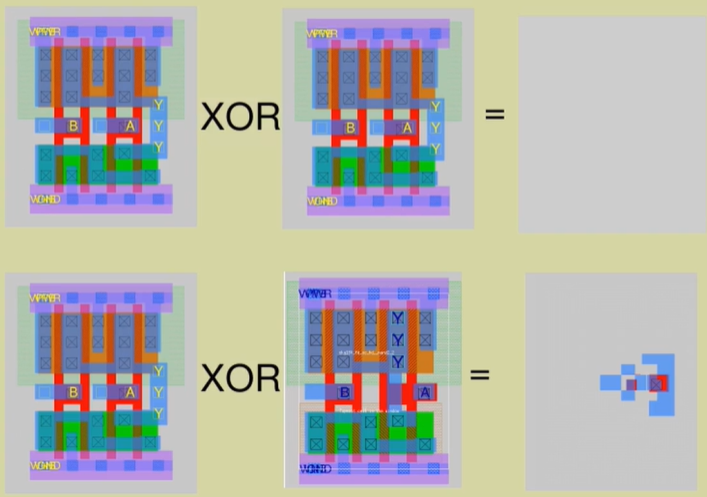

To run an XOR operation in Magic, we can use the following commands.

```
load layout1_name
flatten destination_name
load layout2_name
xor destination_name
```

### Lab - GDS read and Input Styles

First, we shall create a project directory and set it up for running a Magic environment, as we did in previous lab sessions.

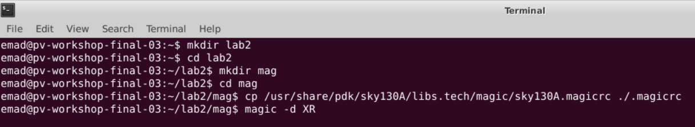

Next, let's explore the cif styles in Magic. To view the possible styles, we use the command `cif listall istyle`. We can also see the current style by using `cif list istyle`. This is shown below. The default style is sky130(vendor). While these 2 commands give us the required information, we can quickly access both data in a single command by attempting to call a bogus style.

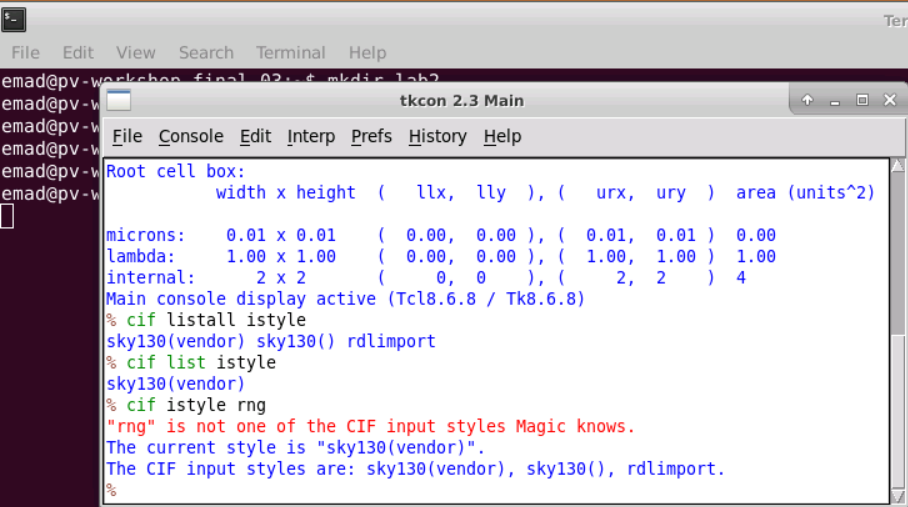

Let's now compare how each of the different input styles affect the layout. First, we will check the sky130() style. To do this we can set the style using `cif istyle sky130()`.

Now, let's read the GDS files from the PDK using the command `gds read /usr/share/pdk/sky130A/libs.ref/sky130_fd_sc_hd/gds/sky130_fd_sc_hd.gds` in the magic console. Since it is a library, the console lists all the subcells. To see the available top level cells, we can run the command `cellname top`. The same thing can be accessed with the menu button Options > Cell Manager. We shall load a simple and2_1 cell. The layout is shown below.

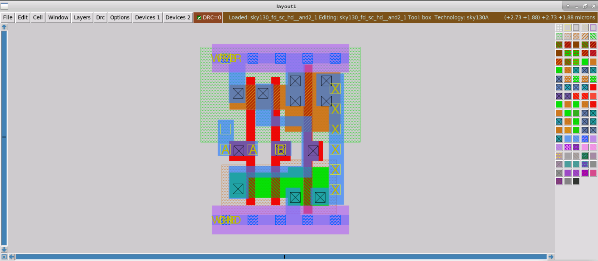

As you can see, the labels in the layout view are marked yellow, which means they are traeted as regular text. Now, we shall use the sky130(vendor) style. To do this, run `cif istyle sky130(vendor)` and then read the gds files from the library. The current and2_1 layout will automatically be overwritten. Let's see what the new layout looks like.

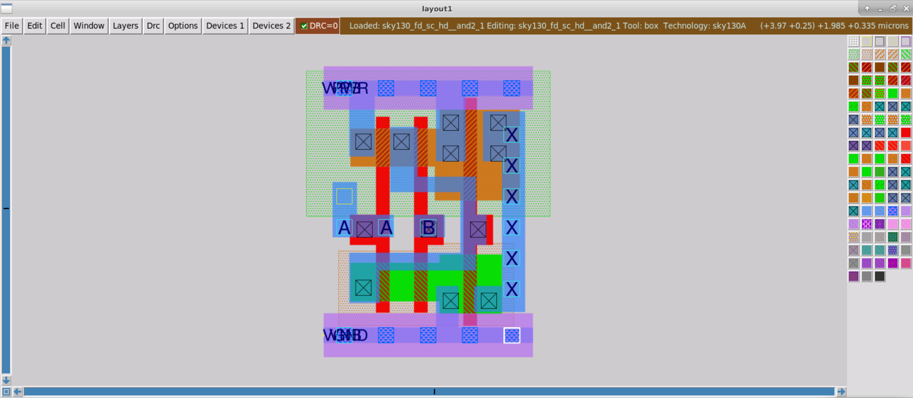

Here, the labels are colored blue, which means they are treated as ports. This shows that when dealing with vendor files, it is wise to use the vendor style.

If you do not want to automatically overwrite existing cells when reading from gds, we can use the `gds noduplicates true` option and then read the file again. This should give the following prompt on the magic console.

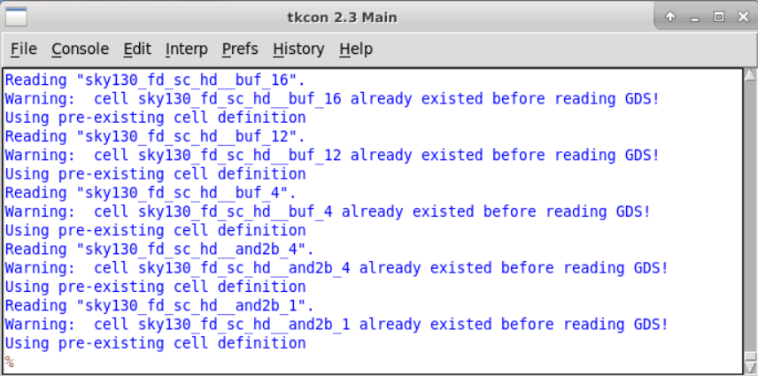

### Lab - Ports and Port Indexes

If we want to inquire about ports on a layout, we can select a port then use the command `port index` in the magic console. However, we can only select one port at a time for this method.

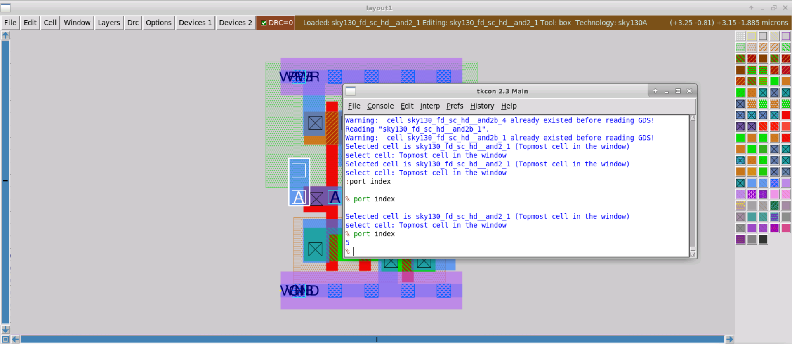

Another method is to use the command `port first` to find the index of the first port. we can then inquire about the port with the commands below.

```
port 1 name
port 1 class
port 1 use
```

This returns the infromation below.

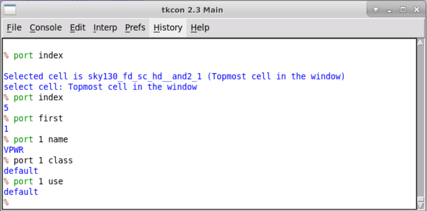

Let's look at the and2_1 subcircuit definition by locating the library directory and opening the file labeled sky130_fd_sc_hd.spice. Here, if we search for the and2_1 cell definition, we can see the following.

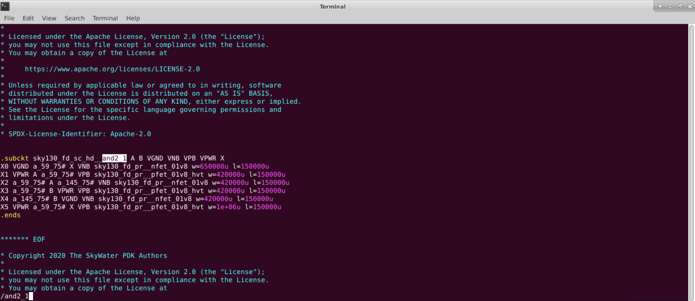

While the cell definition shows the first port to be port A, the gds read of the file in magic shows the first port as VPWR. The port order mentioned in the definition, came from the vendor and should be considered correct. However, port numbering is considered metadata and is not included in the gds file. One way to add metadata to the gds file opened in magic, is to read its corresponding lef file. If we use the command `lef read /usr/share/pdk/sky130A/libs.ref/sky130_fd_sc_hd/lef/sky130_fd_sc_hd.lef` to read the lef file, magic annotates the layout with the metadata captured in the lef file.

Now, when we run the port inquiries like earlier we can see the following.

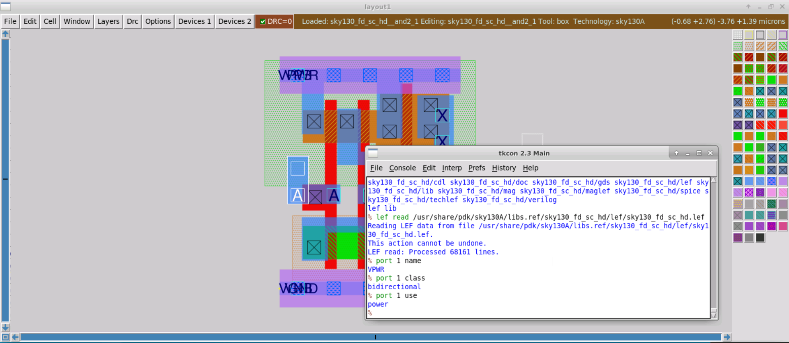

Here, the port order was not updated as lef files do not contain port order metadata. However, port class and use information was imported. Unfortunately, port order is only captured in the spice files from a vendor, but magic has no spice read command as these files provide no layout information.

To read port order from spice files, we can use a custom .tcl script and call it in the magic console with `readspice /usr/share/pdk/sky130A/libs.ref/sky130_fd_sc_hd/spice/sky130_fd_sc_hd.spice`. We may have to load the cell layout again from the Cell Manager. Now if weinquire the same port 1 information, we find the correct port ordering as below.

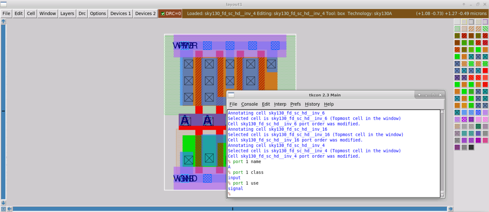

### Lab - Abstract Views

For abstraction, we cannot start with a cell in memory. Let us open a fresh Magic session and read the lef library file using `lef read /usr/share/pdk/sky130A/libs.ref/sky130_fd_sc_hd/lef/sky130_fd_sc_hd.lef` and load the same and2_1 cell from the Cell Manager. This hould bring up an abstract view of the cell as shown below.

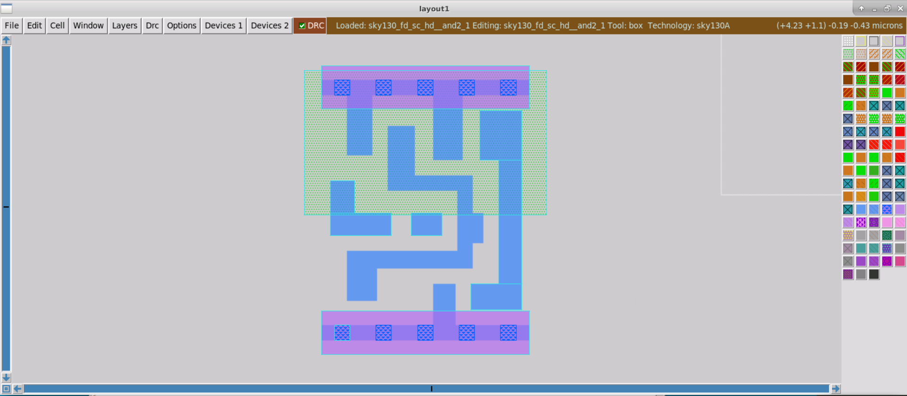

If we check port information, we can see that port order metadata isn't present in the lef files. 

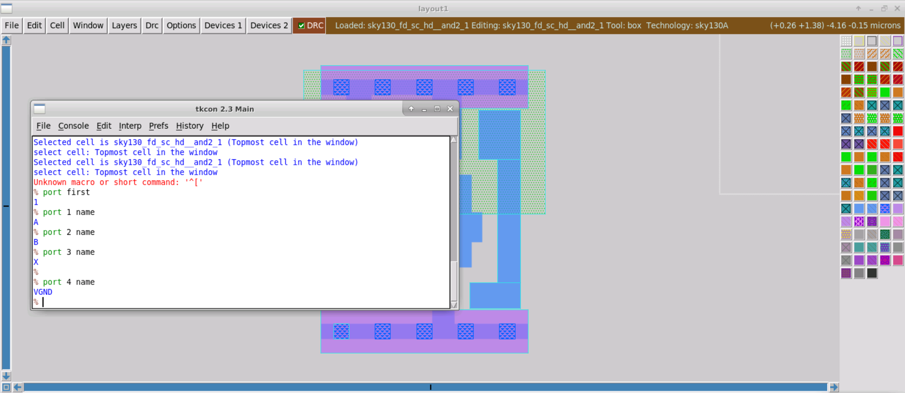

To do this, we can run the readspice script as before and load the cell again.

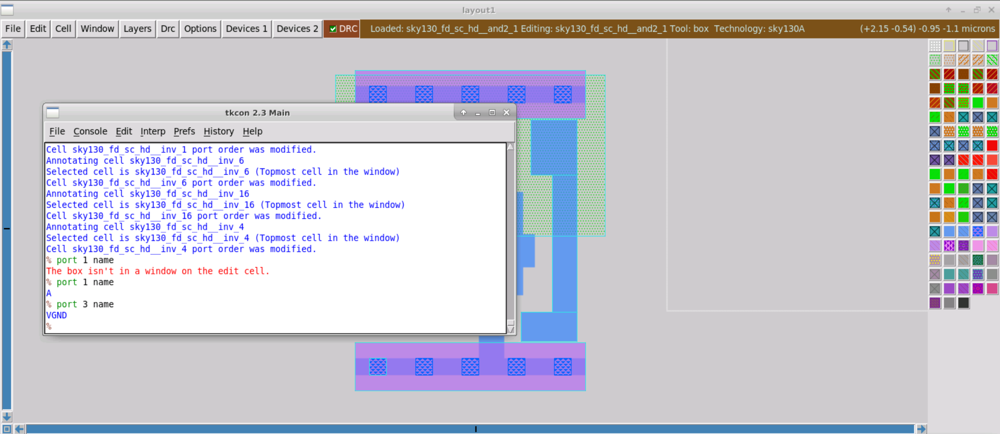

Abstract views however, are not exact representations of the layout. To show this, let's create a new layout using `load test` and instantiate the and cell using `getcell sky130_fd_sc_hd__and2_1`. This brings up an abstract view of the and2_1 cell as below.

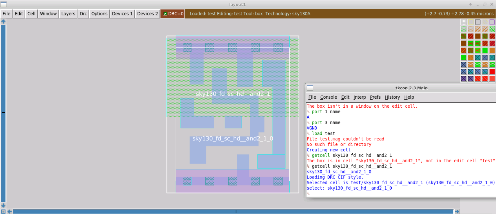

If we try to write this lef file to a gds file using `gds write test`, we get the following error message.

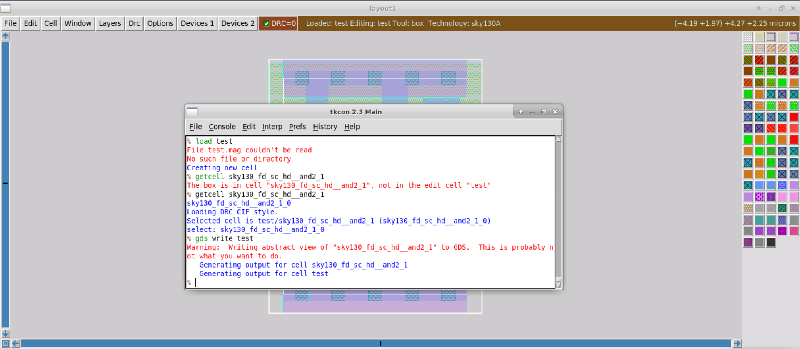

If we try to read the gds file back into a new Magic session, we see the following layout.

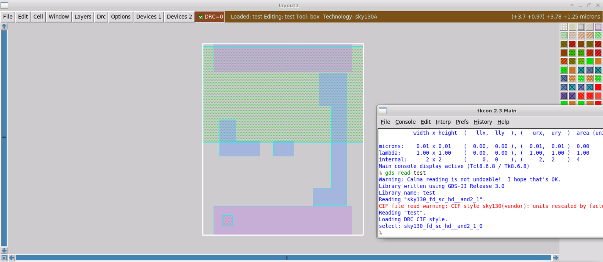

The loaded gds looks different because Magic is not supposed to write abstraction views to gds. If we try to save the test file, and load it back into a new session of Magic, we see the following.

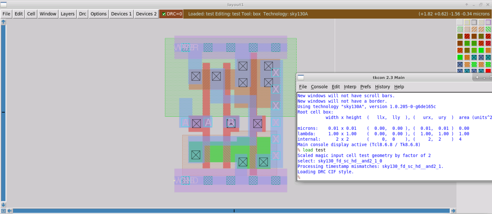

As we have done a `save test` and not `write all`, only the cell that was currently being edited gets saved, and not any subcells. As the cell currently being edited was from the SkyWater PDKs, it found the standard cell contents from the library path. This can be checked using `path`.

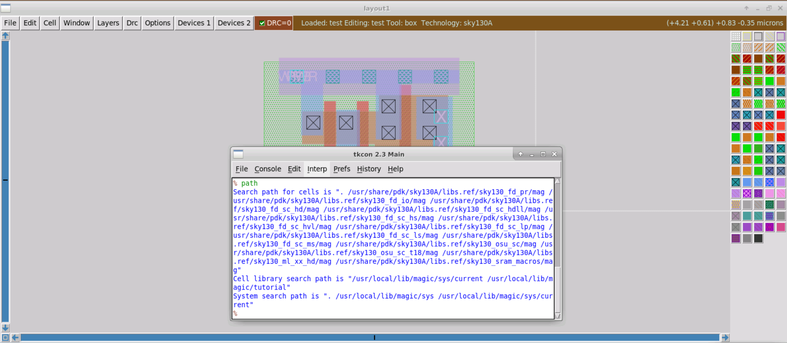

Now, if we were to write this into a gds file using `gds write test`, we would get a valid gds file. If we delve deeper into this and2_1 cell, we will observe that magic is referncing the metadata from a file not from what you see. This is another kind of abstraction, though Magic has tried to make it as faithful to the original as possible. This can be checked by selecting the cell and hitting the > key, then typing `property` in the console.

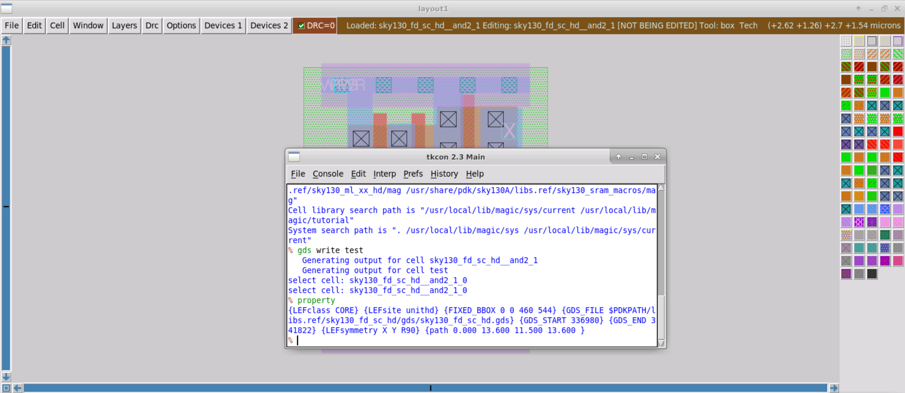

Since this is still a form of abstraction, if we were to make the cell writeable and paint a layer of local interconnect over the cell, then write it to a gds as follows below, then the new gds file would remain unchanged wihtout the painted layer.

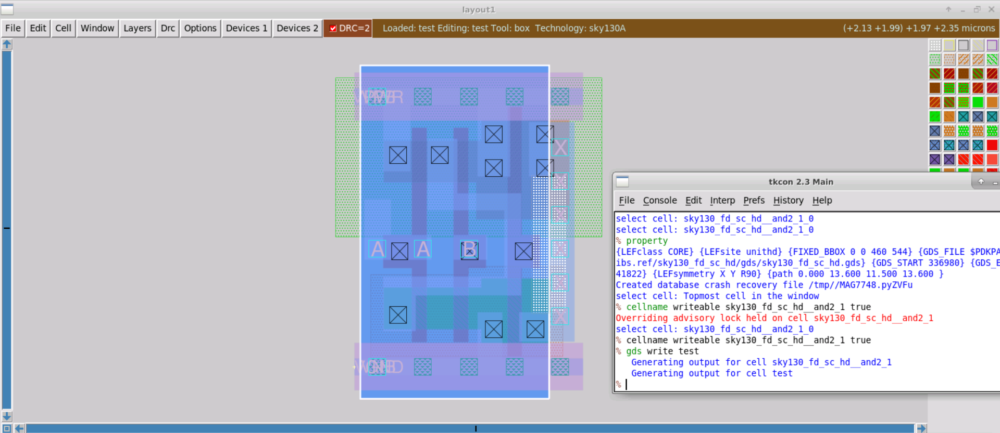

To create a vendor like cell, we can use the `gds readonly` property and execute the following commands in a new session of Magic.

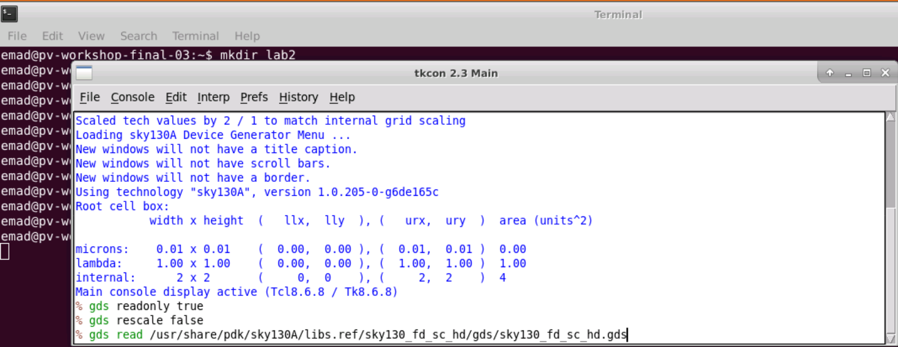

Now, if we run the `property` command, we see the same metadata as before.

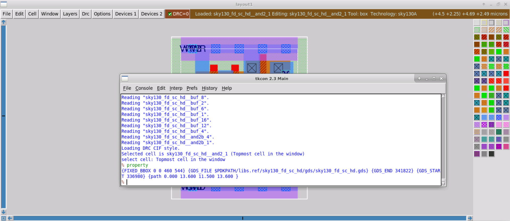

### Lab - Basic Extraction

Let's load the and2_1 cell in magic. Now, extract this cell using the commands below.


Let's look at the spice file just created.

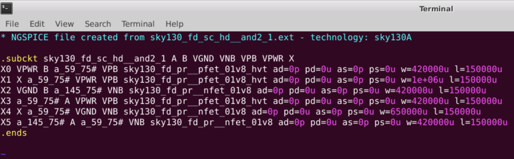

Now, let us run the extraction, but with parasitic capacitances included. To do this, use the following commands.

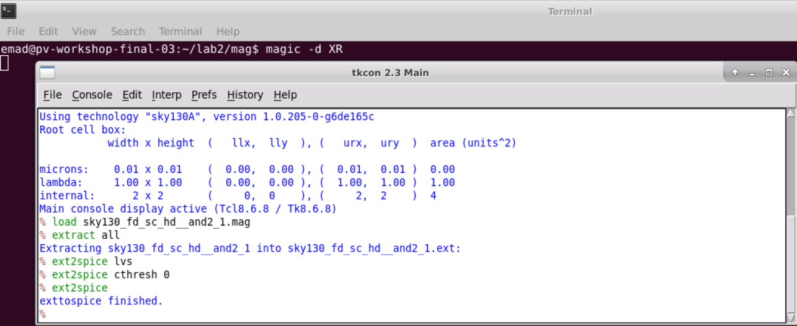

The generated netlist is shown below, and contains lines starting with C to denote the parasitic capacitances.

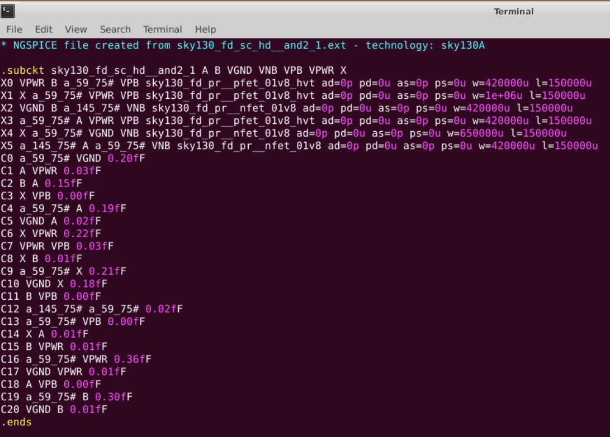

If we do the same extraction, but this time with a cthresh of 0.1, we get reduced number of parasitics in the netlist.

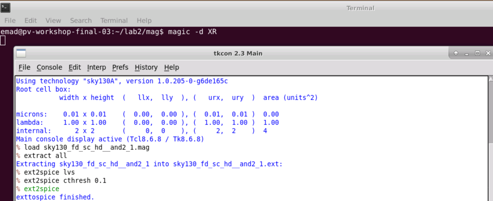

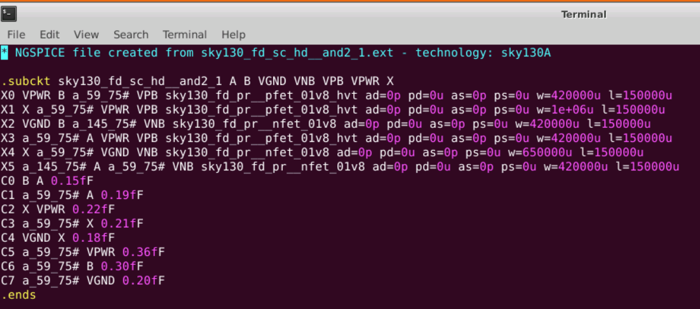

To run a full R-C extraction, we can use the following commands.

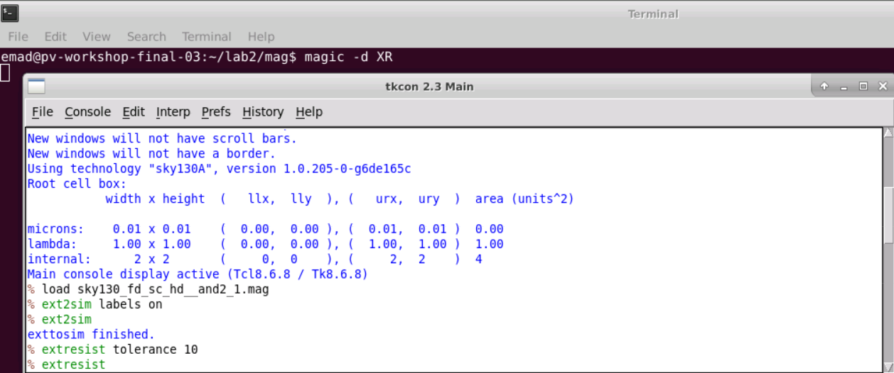

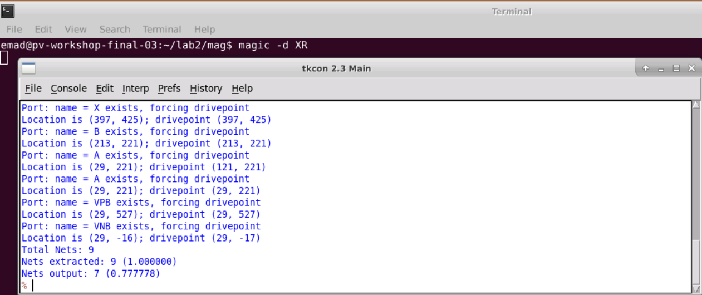

This shows the number of resistor nets found usable, and creates a .res.ext file which holds information to modify the existing .ext file for R parasitics. Next, we extract the netlist using the commands below.


The generated netlist now contains both the R and C parasitic components and is shown below.


While this method does work, it is extremely time consuming for large circuits. For large circuits, it is better to let the router conduct this job as it already knows where all wires are supposed to connect.

### lab - Setup for DRC

To set up standard DRC, we can use the following commands to call a python script.


The output comes in a .txt file. We can view this using a text editor as below.


As we can see, there are DRC errors in the vendor .mag file for the and2_1 subcell since the standard cell layouts do not have internal connections to the well and substrate to save room, and the layout depends on tap cells to make those connections.

The reason we haven't seen these DRC errorsearlier in Magic is because the DRC script runs a full DRC check, while the default DRC style in Magic was a fast DRC. This is shown below.


If we change the DRC style to full, and force a DRC check, we can see DRC errors present in the standard cell.


If we now add and align a tap cell in the existing layout, we see that there are no more DRC errors in the top level.


If we descend into the and2_1 cell layer though, the DRC errors are still present. But in the top level layout, these errors get fixed.


This is how Magic does hierarchical DRC checks. Now, we can save this layout as test3.

### Lab - Setup for LVS

First, let us create a subdirectory for Netgen. Next, we copy the Netgen setup and run Netgen on the and2_1 netlist files. We do this using the following commands.


When executed, we get the following result, showing that the netlists match.


### Lab - Setup for XOR

To conduct XOR verification on masks, let us go back to Magic and load a locally saved version of the and2_1 layout so that it is editable.


Next, we will make a small but noticable change on the layout using the `erase` command.


We now run the following commands to perform the XOR operation against the standard cell. Here, the `-nolabels` option is used so that the operation is only performed on layout geometry.


As you can see, the resultant layout just contains the small layer of polysilicon that was erased. This operation scales very well for larger circuits as well. Let us try this on the test3 layout created earlier.

We load the file, then flatten it into another layout called xortest. Now if we select the and2_1 cell and move it over to the right by 1 place, we should get the following.


If we xor this moved layout with the flattened layout xortest, we get the resulting layout.


While this layout looks rather bizarre, it shows every sliver of every layer that was slightly misaligned due to the shift. Thus, XOR operations are very useful to find such mistakes as well. Since, these kind of mistakes can easily occur while adjusting layouts by human intervention.

## Day 3 - Front-end and Back-end DRC

### Fundamentals of Design Rule Checking

Every silicon manufacturing process has its own tolerances on the designs being manufactured. These tolerances are dependant on the conditions and machines used in the fabrication environment, and are based on probabilities of expected failure/defects found in a manufactured batch, in parts per million. Thus, each process has its own set of rules that need to be adhered to, and these rules are given on the geometry of the layout to prevent chip failure. These are known as design rules, and the process of adhering to these rules is done by design rule checking.

The SkyWater process design rules can be found in detail [here](https://skywater-pdk.readthedocs.io/en/latest/rules.html).

### Back-end Metal Layer Rules

**1. Width Rule**
* Gives the minimum width of a layer.
* Not adhering to this can cause spot defects to be larger than the width of the layer itself, causing open circuits in wires.
* Minimum width for implants are given based on angle of implant and crystalline structure of the silicon. Implants in layer with very small widths may not act like they are supposed to.
* Feature size of a process gives the minimum width of a transistor (or its polysilicon layer)

**2. Spacing Rule**
* Gives the minimum spacing between two layers.
* Not adhering to spacing rales may cause material defects creating shorts between layers.
* Has several complications based on optical effects of the mask.

**3. Wide-Spacing Rule**
* If a wire or piece of layout is wider than a given distance, then other wires of any width must be kept away from it by an additional amount of space.

**4. Notch Rule**
* Similar to the spacing rule (generally the same in most processes).
* Gives the minimum space between two forks of the same piece of layer.

**5. Minimum and Maximum Area Rules**
* Gives the minimum and maximum areas for a metal layer.
* Prevents delamination issues in the metal surface.
* Implants only have minimum area rules, due to concerns same as that of the width rule.

**6. Minimum Hole Area Rule**
* Gives the minimum are a hole in a metal layer must be.
* Small holes in a metal layer make it more likely that oxide grown over the hole may not completely fill it.

**7. Contact Cut Rules**
* A Via is the contact cuts made between metal layers to connect them using other metals.
* As the holes connect layers from above and below, their positioning is critical.
* Contact cut rules ensure masks can be positioned correctly.
* Contact cuts must be surrounded by a minimum amount of metal around them.
* Magic displays arrays of contact cuts for the same layer to layer connect as a single large contact cut (via) for design simplicity.


*day 1 Physical Verification and Design Flows, skywater libs. day 2 gds i/o styles/issues, abstract end exercise extra, extract extra exc inv*
