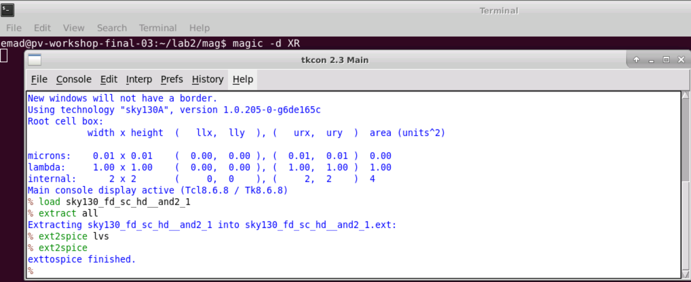
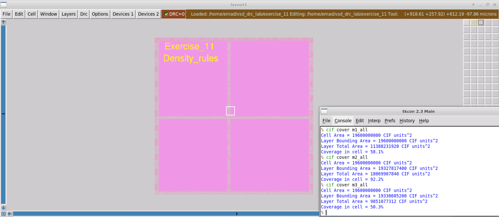
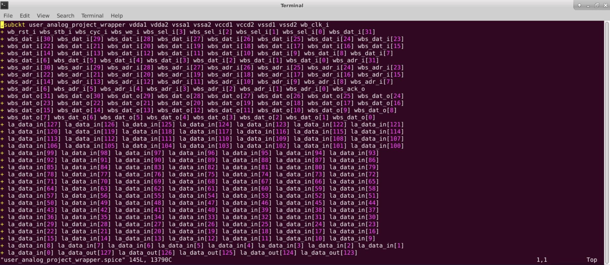
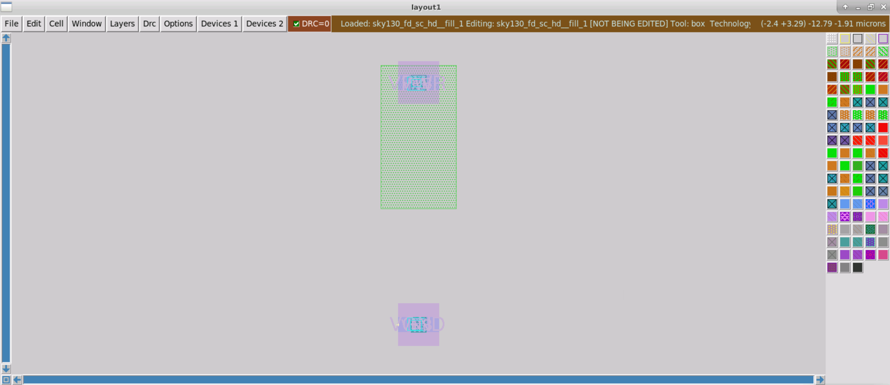
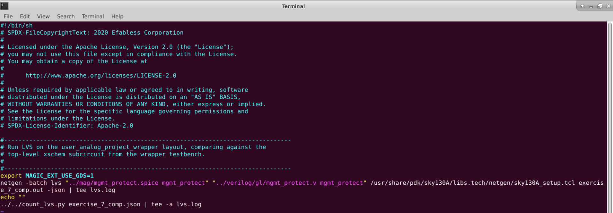
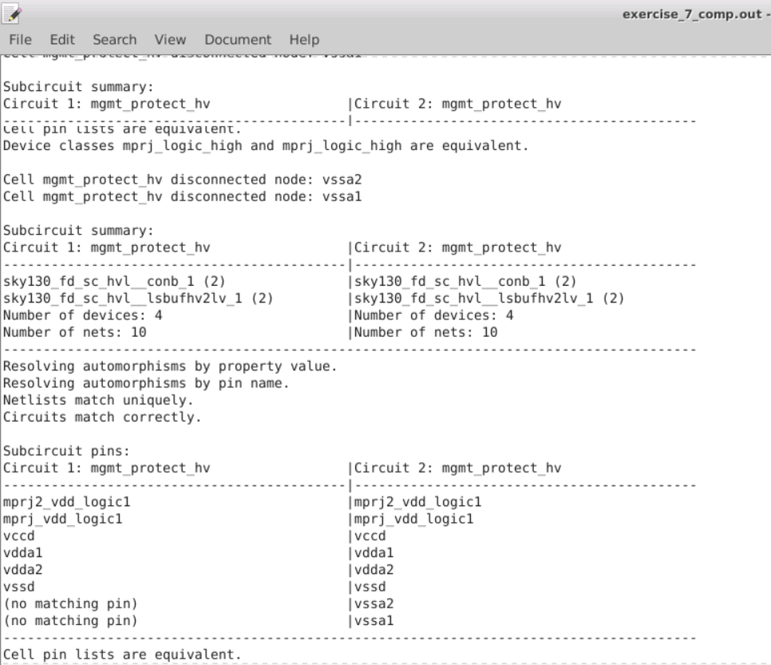
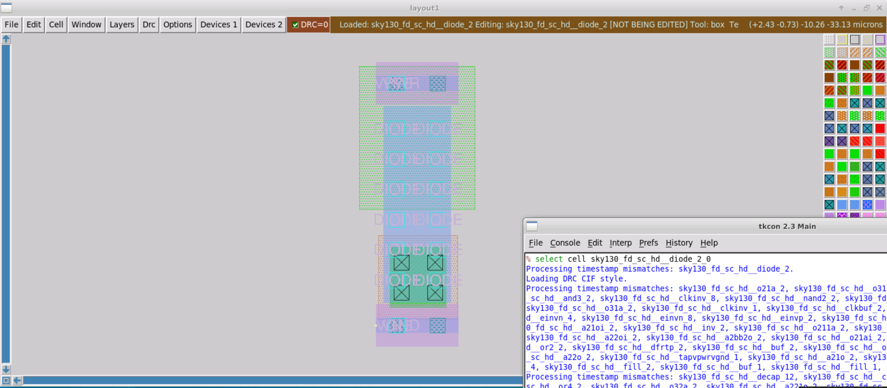

# Physical Verification using SKY130


A 5 day cloud based virtual training workshop conducted by VSD-IAT from 11<sup>th</sup> to 15<sup>th</sup> August. The link to the workshop webpage can be found [here](https://www.vlsisystemdesign.com/physical-verification-using-sky130/). Below is a brief, day-wise documentation about the topics covered in the course, along with my implementations of the lab sessions.

>Note: Day 4 of the workshop consisted of demonstration lectures on OpenLane, and as such are not included in the contents of this documention.

## Table of Contents

  * [Day 1 - Introduction to SkyWater SKY130 and Open-Source EDA Tools](#day-1---introduction-to-skywater-sky130-and-open-source-eda-tools)
    + [SkyWater PDK](#skywater-pdk)
    + [Open-Source EDA Tools](#open-source-eda-tools)
    + [Physical Verification and Design Flows](#physical-verification-and-design-flows)
    + [Lab - Checking Tool Installations](#lab---checking-tool-installations)
    + [Lab - Creating an Inverter Design](#lab---creating-an-inverter-design)
  * [Day 2 - Design Rule Checks and Layout Vs. Simulation](#day-2---design-rule-checks-and-layout-vs-simulation)
    + [Fundamentals of Physical Verification](#fundamentals-of-physical-verification)
    + [Data Formats and GDSII](#data-formats-and-gdsii)
    + [Extraction Styles and Options in Magic](#extraction-styles-and-options-in-magic)
    + [GDS Reading and Writing in Magic](#gds-reading-and-writing-in-magic)
    + [DRC Rules in Magic](#drc-rules-in-magic)
    + [LVS Setup for Netgen](#lvs-setup-for-netgen)
    + [XOR Verification](#xor-verification)
    + [Lab - GDS read and Input Styles](#lab---gds-read-and-input-styles)
    + [Lab - Ports and Port Indexes](#lab---ports-and-port-indexes)
    + [Lab - Abstract Views](#lab---abstract-views)
    + [Lab - Basic Extraction](#lab---basic-extraction)
    + [lab - Setup for DRC](#lab---setup-for-drc)
    + [Lab - Setup for LVS](#lab---setup-for-lvs)
    + [Lab - Setup for XOR](#lab---setup-for-xor)
  * [Day 3 - Design Rule Checking](#day-3---design-rule-checking)
    + [Fundamentals of Design Rule Checking](#fundamentals-of-design-rule-checking)
    + [Back-end Metal Layer Rules](#back-end-metal-layer-rules)
    + [Local Interconnect Rules](#local-interconnect-rules)
    + [Front-end Rules](#front-end-rules)
    + [Wells, Taps and Net Rules](#wells-taps-and-net-rules)
    + [Deeps N-Well and High Voltage Rules](#deeps-n-well-and-high-voltage-rules)
    + [Device Rules](#device-rules)
    + [Miscellaneous Rules and Latch-up, Antenna and Stress Rules](#miscellaneous-rules-and-latch-up-antenna-and-stress-rules)
    + [Density Rules](#density-rules)
    + [Recommended, Manufacturing and ERC Rules](#recommended-manufacturing-and-erc-rules)
    + [Lab - Width and Spacing Rules](#lab---width-and-spacing-rules)
    + [Lab - Wide Spacing and Notch Rules](#lab---wide-spacing-and-notch-rules)
    + [Lab - Contact Cuts (Via) and its DRC Errors](#lab---contact-cuts-via-and-its-drc-errors)
    + [Lab - Minimum Area and Minimum Hole Rule](#lab---minimum-area-and-minimum-hole-rule)
    + [Lab - Wells and Deep N-Wells](#lab---wells-and-deep-n-wells)
    + [Lab - Derived Layers](#lab---derived-layers)
    + [Lab - Parameterised and PDK Devices](#lab---parameterised-and-pdk-devices)
    + [Lab - Angle And Overlap Rule](#lab---angle-and-overlap-rule)
    + [Lab - Unimplemented Rules](#lab---unimplemented-rules)
    + [Lab - Latch-up and Antenna Rules](#lab---latch-up-and-antenna-rules)
    + [Lab - Density Rules](#lab---density-rules)
  * [Day 5 - Running Layout Vs. Schematic](#day-5---running-layout-vs-schematic)
    + [Fundamentals of LVS](#fundamentals-of-lvs)
    + [Schematics and LVS Matching](#schematics-and-lvs-matching)
    + [LVS Netlists Vs. Simulation Netlists](#lvs-netlists-vs-simulation-netlists)
    + [Running Netgen](#running-netgen)
    + [Netgen Matching Algorithm](#netgen-matching-algorithm)
    + [Pre-Matching Analysis and Hierarchical Checking](#pre-matching-analysis-and-hierarchical-checking)
    + [Pin and Property Checking](#pin-and-property-checking)
    + [Series/Parallel Combining](#seriesparallel-combining)
    + [Symmetry Breaking](#symmetry-breaking)
    + [Interpreting Netgen Results](#interpreting-netgen-results)
    + [Lab - Introduction to LVS](#lab---introduction-to-lvs)
    + [Lab - LVS with Subcircuits](#lab---lvs-with-subcircuits)
    + [Lab - LVS with Blackboxes Subcircuits](#lab---lvs-with-blackboxes-subcircuits)
    + [Lab - LVS with SPICE Low Level Components](#lab---lvs-with-spice-low-level-components)
    + [Lab - LVS For Power-On-Reset Circuit](#lab---lvs-for-power-on-reset-circuit)
    + [Lab - Layout Vs. Verilog for Standard Cell](#lab---layout-vs-verilog-for-standard-cell)
    + [Lab - LVS with Macros](#lab---lvs-with-macros)
    + [Lab - LVS for Digital PLL Design](#lab---lvs-for-digital-pll-design)
  * [Acknowledgements](#acknowledgements)

## Day 1 - Introduction to SkyWater SKY130 and Open-Source EDA Tools

### SkyWater PDK

The SkyWater Open Source PDK is a joint project between Google and the SkyWater Technology Foundry, which provides a fully open source Process Design Kit (PDK), and its related resources. The SkyWater open PDK public repository contains the following:
 - [Documentation](https://skywater-pdk.rtfd.io/) 
 - [PDK Library and files](https://github.com/google/skywater-pdk)
 - as well as the [Community](https://join.skywater.tools/)
 
 
 
The "130" in SKY130 stands for the feature size, which is the length of smallest transistor that can be manufactured in the process.

### Open-Source EDA Tools

Open_PDKs is a Makefile based installer that takes files from the SkyWater PDKs and reformats them for a number of open source EDA tools, which can be found at [R. Timothy Edwards' github page](https://github.com/RTimothyEdwards/open_pdks).

Tools currently supported by open_pdks:
- Magic
- Klayout
- Openlane
- Xschem
- Netgen
- Ngspice
- IVerilog
- qflow
- IRSIM
- xcircuit

To install SKY130 PDKs, we must clone the repository and specify the process to compile and install using the following commands.

```
git clone https://github.com/RTimothyEdwards/open_pdks
cd open_pdks
configure --enable-sky130-pdk
make
sudo make install
```

The ```make``` process grabs the SKY130 repository and submodules, as well as a few third party repositories to use in the install. It then builds the libraries from these various repositories.

The libraries supported by open_pdks are:
- Digital standard cells (ex: sky130_fd_sc_hd)
- Primitive devices/analog (ex: sky130_fd_pr)
- I/O cells (ex: sky130_fd_io)
- 3rd party libraries (ex: sky130_ml_xx_hd)

Open_PDKs uses a common installed filesystem structure, where the SkyWater PDKs are placed under the directory ```/usr/share/pdk/sky130A/```. Under this main SK130 PDK directory, are 2 subdirectories ```libs.tech```, which contains all subdirectories for the open source tool setups, and ```libs.ref```, which contains the reference libraries in various formats. The project directory follows a similar format, with a ```project_root/``` directory containing subdirectories for each tool or flow needed.

### Physical Verification and Design Flows

Like functional verification, where we check if the voltages, signals and timings match the specification; physical verification is to check whether you have a mask layout that matches what you think the circuit should be. The general design flow for physical verification is given below.


The two major steps in physical verification are Design Rule Checking, to ensure that your layout matches all the rules provided by the foundy for that specific process, and Layout Vs. Schematic, which is to ensure that your layout netlist matches with your schematic netlist.

### Lab - Checking Tool Installations

1. Magic: It can be run by giving the command ```magic``` in the command line interface. This brings up a layout window and a console window that is a stock tcl interpreter used to run commands for layout and actions. We can get the tcl interpreter in the terminal itself instead of the seperate console window by using the option ```magic -noconsole```. Magic can also be run without the graphics layout window using the option ```magic -dnull - noconsole```, and should be called as such when running from a script. To run magic in batch mode, we use the command ```magic -dnull -noconsole filename.tcl```.

2. Netgen: We can run Netgen using the command ```netgen``` in the terminal. It is completely command driven and has no graphics interface. Its console window is a stock tcl interpreter like magic as well. We can get the tcl interpreter in the terminal itself instead of the seperate console window by using the option ```netgen -noconsole```. To run netgen in batch mode, we use the command ```netgen -batch source filename.tcl```. Netgen also provides a GUI window written in python that can be accessed using ```usr/local/lib/netgen/pyhton/lvs_manager.py```, though this interface hides many useful options that cannot be accessed with just this window itself.

3. Xschem: It is accessed using the command ```xschem``` in the terminal. This should bring up a schematics window. Unlike netgen and magic however, xschem has no seperate console window and uses the native command line terminal for tcl commands. Xschem can be run in batch mode with the command ```xschem --tcl filename.tcl -q```.

4. Ngspice: It can be run using the command ```ngspice``` in the linux command line. Ngspice has its own prompt and runs its own set of interpreter commands that aren't based on tcl. It can be run in batch mode using the option ```ngspice -b```.

Let's get acquainted with these open source tools with a basic example of an inverter design. First, we must create a directory for the design and initialise subdirectories for each of the open source tools that we will be using. This is shown below.


Next, we must set up each directory for its respective tool to run properly with the SkyWater PDKs. This can be done by creating a symbolic link between the just initialised subdirectories and the SKY130 submodules created with the open_pdks installer. This is done using ```ln -s /file_path``` in the desired subdirectory, and is shown below. As we will run ngspice simulations using xschem, so we setup ngspice under the xschem subdirectory itself.


Let us run Xschem using the command ```xschem```. This brings up a display for xschem with a lot of example schematics, introducing you to SKY130 devices as seen below. Examples can be accessed by clicking the relevant rectangle and pressing the E key on the keyboard. We can return to the menu by pressing CTRL+E. The F key resizes the schematic to fit the window.


Now, we can check the magic installation using the command ```magic``` in the /mag subdirectory. This should bring up the 2 magic windows, with the layout window displaying "Technology: sky130A", along with many colors and icons displaying the available layers in this technology, as show below.


We can use the command ```magic -d XR``` to invoke a cairo graphics package which uses 3D acceleration to get better rendering than the default graphics. There is also an OpenGL based graphics package that can be accessed using ```magic -d -OGL```. 

Useful Magic Shortcuts:
1. Left and right mouse buttons to adjust the cursor box
2. Shift+Z to zoom out
3. Middle mouse button/P to select a layer (also known as painting)
4. E to erase whatever is present in the cursor box (can also be done ny clicking the middle mouse button on an empty part of the layout)
5. V can be used to view the entire layout
6. CTRL+P opens up the parameter options for the selected device
7. S key can be used to select layers
8. Typing the ```what``` command in the magic console gives information on the selected layer
9. ; key can be used to type commands in the magic console without moving between windows, until the Enter key is pressed
10. I key can be used to select a device, and M key is used to move them

The purple layer "metal1" below shall be most used to connect devices in further lab experiments.


We can create some devices using the two Devices drop down buttons. Let us select the nmos (mosfet) under "Devices 1" and set the width to 2 um, length to 0.5 um and fingers to 3. This should result in the following device being created.


### Lab - Creating an Inverter Design

Let's run xschem and open a new schematic under the File option. To add a component we use the Ins key. Select the SkyWater library directory path to access SkyWater components and choose the fd_pr library. To create an inverter, we need a basic nfet and pfet. So let's select a nfet and pfet device from the insert window and place it anywhere in the schematic. 


As we want to turn the schematic to a layout, it is good practice to keep the circuit parts that will be turned into a layout self-contained so it doesn't have any unnecessary components in it that do not need to be present in the layout. It is also good practice not to use any specific power supply pins as there is no concept of a global supply pin/net in a layout. Not adhering to these practices can cause problems later when verifying layouts.

As pins are not PDK specific, they can be found under the xschem library in the insert window. These are named as ipin.sym, opin.sym and iopin.sym. We can place the pins and use the M key after hovering the component to move them around on the schematic window. The C key can be used to copy components. Similarly, the Del key can be use to erase components. Now, we can make use of the W key to insert wires between components and make connections. Next, we should rename each pin to something sensible using the Q key to bring up the parameter window.


To configure the properties of the devices, we can select them by clicking on them and bringing up the parameter window with the Q key. We change the length in the parameter window to 0.18 as the default value of 0.15 is restricted to sram devices only. We can set the number of fingers to 3, and the width of each finger to 1.5. As we have 3 fingers however, the total width in the parameter window must be set to 3 times of the finger width, which is 4.5. The other parameters are PDK specific so it is best not to alter them unnecessarily.


Similarly, we can adjust the parameters of the pfet to 3 fingers, width of 1 per finger, and a length of 0.18. We must specify the body to be connected to the Vdd pin as it is a 3 pin pfet.


Now, we have a valid schematic for a basic inverter. We can save this using "Save as" and saving it under the local user directory and renaming it to a suitable name.

To functionally validate the schematic, we must create a testbench that is separate from the schematic. First, we create a symbol for the schematic, as the schematic will appear as a symbol in the testbench. To do this, we click on the Symbol menu and select "Make symbol from schematic". Now, we can create a testbench schematic using the new schematic option and insert the generated symbol from the local directory using the Ins key.

The testbench will be very simple. We will generate a ramp input and watch the output response after connecting the power supplies. To do this, we can insert 2 voltage sources from the default xschem library, one ofr the input and one for the supply. We can connect these and add a GND node to the supply connections. Next, we must create "opins" for the input and ouput signals that we want to see in Ngspice. If done correctly, we should get the following.


Next, we set the values for the voltages. The supply voltage is set to 1.8v. For the input voltage, we must set the supply to a piece-wise linear function to get ramp like behaviour as follows.


Here, the PWL function has voltage and time values that state that the supply will start at 0v, then start to ramp up from 20 ns till it reaches its final value at 900 ns of 1.8v. Next, we must place two more statements for ngspice, but as these aren't specific to any component, they must be placed in text boxes. To place a text box, we select the code_shown.sym component under the xschem library.

The first one will specify the location of the device models used in the device schematic. We will use a .lib statement that selects a top level file that tells ngspice where to find all the models and also specifying a simulation corner for all the models. We shall use the typical corner with ```value = ".lib /usr/share/pdk/sky130A/libs.tech/ngspice/sky130.lib.spice tt"```. For the second block, we shall use the statement as follows.

```value = ".control
tran 1n 1u
plot V(in) V(out)
.endc"
```

This will tell ngspice to run a transient simulation for 1 ns and monitor voltages for the in and out pins. Finally, we should get the completed testbench schematic as follows, and save this as inverter_tb.sch.


To generate the netlist we can click on the Netlist button, then we can simulate it in Ngspice by clicking the Simulate button. We should get the following waveform, which confirms that our schematic behaves as an inverter.


Now that we have functionally verified our schematic, we can proceed to create a layout for it. To do this we must go back to our inverter schematic. first, we must ensure that we click on the Simulation menu and select the "LVS netlist: Top Lvel is a .subckt" option. We wait a few seconds and go back to the Simulation menu to check whether a tick mark appears beside the aforementioned option. This verifies if we have properly defined a sub circuit for creating a layout cell with pins in the layout. Finally, we generate a netlist for the schematic by clicking the Netlist button and exit Xschem.

Now we can import the schematic to the layout in Magic. First we run magic, then click on File > Import SPICE and then select the inverter.spice file from the xschem directory. If done correctly, we should see the following layout open up in magic.


As you can see, the schematic import does not know how to do analog place and route as it is very complicated. We must place them in the best positions and wire them up manually. First, we can start by placing the pfet device above the nfet and adjusting the placement of the input, output and supply pins. We should get the following.


Next, we must set some parameters that are only adjustable in the layout which will make it more convenient to wire the whole layout up. First, we set the "Top guard ring via coverage" to 100. This will put a local interconnect to metal1 via ta the top of the guard ring. Next, for "Source via coverage" put +40 and for "Drain via coverage" put -40. This will split the source drain contacts, making it easy to connect them with a wire. For the nfet, we set the "Bottom guard ring via coverage" to 100, while the source and drain via coverages are set to +40 and -40, respectively, like the pfet.

Now, we can start to paint the wires using metal1 layers. First, we connect the source of the pfet to Vdd and source of the nfet to Vss. Next, we connect the drains of both mosfets to the output. Finally, the input is connected to all the poly contacts of the gate. Now, we should get something as shown below.


Now, we can sav the file and select the autowrite option. Then we run the following commands in the magic console.

```
extract do local
extract all
```

The first command ensures that magic writes all results to the local directory. The second command does the actual extraction. As the output is in magics own format, but we want to simulate the netlist in spice, so we use the command ```ext2spice lvs``` which sets up the netlist to hierarchical spice output in ngspice format with no parasitic components which is good for simulation but not for running lvs. Next, we run the command ```ext2spice``` which generates the spice netlist. Now we can quite magic.

To run LVS, we can first clear any unwanted files from the mag subdirectory. The .ext files are just intermediate results from the extraction and can be removed using the command ```rm *.ext``` if needed. We can also clean up extra .mag files using the command ```/usr/share/pdk/bin/cleanup_unref.py -remove .```, which were any paramaterised cells that were created and saved but not used in the design.

Now we can run LVS by entering the netgen subdirectory and using the command ```netgen -batch lvs "../mag/inverter.spice inverter" "../xschem/inverter.spice inverter"```. Remember to always use the layout netlist first and schematic netlist second as then in the side by side result the layout is on the left and the schematic is on the right. Each netlist is represented by a pair of keywords in quotes, where the first is the location of the netlist file and the second is the name of the subcircuit to compare. As we can see from the result below, there was an issue in the wiring and the netlists do not match. This is due to wiring errors in the layout.


If the layout is correct, the last step would be to validate the layout netlist again with parasitics included. We can include both resistive and capacitive parasitics in magic netlists, though this process is complicated and requires manual interventions, excluding it from the scope of this exercise. Capacitive parasitics can be easily included though, by using the following commands in the magic console window during extraction.

```
extract do local
extract all
ext2spice lvs
ext2spice cthresh 0
ext2spice
```

Here, the command ```ext2spice cthresh 0``` tells magic to add all the parasitic capacitances to the spice netlist. If we now view the netlist file in an editor, we can see multiple lines beginning with C, which detail the parasitic capacitances.


By ordering the original testbench pin layout according to the new netlist, and replacing the old subcircuit definition, we can run an ngspice simulation on the layout netlist with parasitic capacitances included. Though, the waveform should not change much.

## Day 2 - Design Rule Checks and Layout Vs. Simulation

### Fundamentals of Physical Verification

As chips get denser, the scale of physical verification increases. While chip designs can be hierarchical, physical verification is not. The two primary aspects of physical verification are as follows:

1. Design Rule Checks (DRC)
 * Ensures that the design layout meets all the silicon foundry rules for mask making
2. Layout vs. Schematic (LVS)
 * Makes sure that the design layout electrically matches the design, as implemented in schematic form or any form that electrically describes the design spec

While initially physical verification was conducted from independent sources, and more the independent sources, the better. Nowadays, in the age of automation, wherein chips are designed from a single source (RTL design), the LVS process is now about checking the design through different flows; one starting at the RTL source and working forwards, while the second starting at the finished layout and working backwards. This way the tools used cross check each other.


Even though the chip design process is automated, there are still points where manual intervention occurs, and physical verification must check that any manual intervention hasn't broken something. Though, mostly in case of errors we look for how the tool got it wrong and how we can modify the setups to overcome the problem. Increasing the number of tools used, increases the robustness of the physical verification process. 

### Data Formats and GDSII

For some form of standardisation to describe integrated circuits, a standard file format is needed. These formats must describe both data (rectangles, subcells, polygons) and metadata (labels, cell boundaries and instance names, etc.) regarding IC layouts. 

Some common file formats are:
-  Caltech Intermediate form (.cif)
-  GDSII stream format
-  Open Artwork System Interchange Standard (OASIS)

The GDSII format is now the industry standard accross foundries for representing IC layouts. what distinguishes GDS from other formats are its layer:purpose pairs. Instead of describing each layer with a name such as DIFF for diffusion, it describes them as a pair of numbers, seperated by a colon (ex. 65:20). Here, one number denotes the layer (such as diffusion, metal1, poly), while the other number denotes the purpose (such as blockage, net, drawing, label, pin, ,etc.). Though, layer:purpose pairs may be inconsistent across foundries. More on the GDSII format can be found [here](https://boolean.klaasholwerda.nl/interface/bnf/gdsformat.html).

>Note: Since most of these file formats do not describe all metadata (such as pin use/class, device types), it is very common to lose some of your metadata after writing out a full chip to gds.

### Extraction Styles and Options in Magic

The layout tool needs to be able to independently generate a netlist by looking at nothing other than the mask geometry of the layout. This process is known as Extraction. Extraction in Magic is a two stage process, wherein magic generates an intermediate netlist format called the .ext, after which it is converted to the required netlist format such as spice.


All devices, instances, connections between cells, subcells, nets, as well as parasitics are present in the netlist. This netlist can be fed to a simulator such as Ngspice, along with a schematic captured netlist to compare the results of the two. 

Even though magic can create a netlist for simulation, it has no idea how to actually simulate the netlist. To simulate a netlist from a layout, we must provide all the missing information. This includes the testbench netlist, along with the necessary stimuli for simulation. As the layout editor knows nothing about the actual device models, we need to use include statements to add all device models used in the layout. A subcircuit netlist is this generated netlist from the layout editor, and must be included as well. Finally, an analysis control block is needed to tell the simulator what kind of simulation to run as well as its simulation parameters.

There are three extraction styles available in magic: ngspice(), ngspice(orig) and ngspice(si); and can be selected using the commands below.

```
extract style ngspice()
extract style ngspice(orig)
extract style ngspice(si)
```

Some extraction options in magic are as follows.

```
ext2spice lvs
ext2spice cthresh value
ext2spice scale on|off
ext2spice hierarchy on|off
ext2spice subcircuit top on|off
ext2spice global on|off
ext2spicemerge on|off
```

>Note: Magic also stores layer heights/thicknesses, and a three dimensional view of the layout can be rendered by magic's 3D engine using th menu button Option > 3D Display.

### GDS Reading and Writing in Magic

GDS files can be accessed in Magic with the ```gds``` command. To read a GDS file in magic, we use ```gds read file_name```. Some important read options for gds files in magic are listed below.

```
gds readonly true|false  //Allows ceratin cells to be read-only, preventing magic from changing their gds descriptions in the final output gds file
gds flatglob expression  //Flattens cells in question to be merged up into the hierarchy above them, preventing unnecessary heierarchy in the layout
gds flatten true
gds noduplicates true    //Tells magic to ignore cell definitions in gds files that it already has in memory
```

GDS files can be written in magic using the command ```gds write file_name```, and some of its options are listed below.

```
gds library true      //Used to create gds library files with subcells with no concept of a top level layout
gds addendum true     //Ignores read-only cell definitions when it generates an output
gds merge true|false  //Turns rectangles and triangles present in the design into merged polygons for easier viewing
```

### DRC Rules in Magic

Magic implements an interactive DRC, wherein it shows DRC errors when you make them. As this process is computationally expensive, magic uses 3 styles for running DRC, namely:
1. ```drc(full)``` - complete checks (slow)
2. ```drc(fast)``` - typical checks (fast)
3. ```drc(routing)``` - metal checks (fastest)

```drc off``` can be used to turn the DRC interactive engine off. To prevent the DRC engine from running checks on a cell that is known to be good, is to keep it in abstract view. While magic does check inside each cell in a layout, it is possible that the errors inside a cell get resolved in the hierarchy above it.

The two basic DRC rule checking methods in Magic are,

1. Edge-based rules (spacing, width, surround, extend)
2. Boolean geometry rules (AND, XOR, GROW, SQUARES, etc.)

### LVS Setup for Netgen

Netgen is a tool used for running LVS checks. It knows nothing about layouts, and only knows about netlists and how to read and compare them. Netgen does not need to know anything about any components in the design, it juts needs to know wheter they match in the layout and schematic.

The LVS technology setup file tells the LVS tool what all the device names are, how they should or shouldn't be combined in series and parallel, whether any pins on the device are permutable (interchangeable), which properties are interesting to compare between netlists, which properties should be ignored, and whether any device must be ignored.

Netgen commands used in the open_pdks setup file are:
1. `property`
2. `ignore`
3. `permute`
4. `equate`

The LVS tool handles hierarchy by making certain assumptions about the circuit, like the subcircuits will have the same name or contents in the schematic and layout. Next it will survey the hierarchies in both the netlists to check whether these assumptions are true. It will attempt to check whether it can make the hierarchies match better by flattening one or more cells. After it knows that a subcircuit in one netlist is supposed to be a match in the other netlist, then it conducts a full match analysis. If it cannot get the circuits to match, then it concludes that perhaps it should not try to match the two subcircuits at all, absorbing both of them into the parent cell in the hopes that this will resolve the issues with the hierarchy. Although, flattening everything in the hierarchy can cause cascading mismatch problems, leading to a huge mess in the LVS. Thus, a proper approach is required when tackling LVS.

One useful feature of Netgen is its ability to do not just layout vs. schematic, but layout vs. verilog as well, though certain syntax in verilog are illegal and not supported.

LVS also employs the concept of Black-Boxing, where the tool compares the netlists by gate and not transistors. This means it checks the device behaviour, and not each individual transistor, though this can be done if needed.

### XOR Verification

This is a physical verification method used to compare 2 layouts. Here, an XOR operation is applied on the masks of the two layouts. Where both the masks either have nothing or share the same geometry, we see nothing, and only where one mask has something and the other mask has nothing, or vice versa, do we see something. This is useful in mask revisions.


To run an XOR operation in Magic, we can use the following commands.

```
load layout1_name
flatten destination_name
load layout2_name
xor destination_name
```

### Lab - GDS read and Input Styles

First, we shall create a project directory and set it up for running a Magic environment, as we did in previous lab sessions.


Next, let's explore the cif styles in Magic. To view the possible styles, we use the command `cif listall istyle`. We can also see the current style by using `cif list istyle`. This is shown below. The default style is sky130(vendor). While these 2 commands give us the required information, we can quickly access both data in a single command by attempting to call a bogus style.


Let's now compare how each of the different input styles affect the layout. First, we will check the sky130() style. To do this we can set the style using `cif istyle sky130()`.

Now, let's read the GDS files from the PDK using the command `gds read /usr/share/pdk/sky130A/libs.ref/sky130_fd_sc_hd/gds/sky130_fd_sc_hd.gds` in the magic console. Since it is a library, the console lists all the subcells. To see the available top level cells, we can run the command `cellname top`. The same thing can be accessed with the menu button Options > Cell Manager. We shall load a simple and2_1 cell. The layout is shown below.


As you can see, the labels in the layout view are marked yellow, which means they are treated as regular text. Now, we shall use the sky130(vendor) style. To do this, run `cif istyle sky130(vendor)` and then read the gds files from the library. The current and2_1 layout will automatically be overwritten. Let's see what the new layout looks like.


Here, the labels are colored blue, which means they are treated as ports. This shows that when dealing with vendor files, it is wise to use the vendor style.

If you do not want to automatically overwrite existing cells when reading from gds, we can use the `gds noduplicates true` option and then read the file again. This should give the following prompt on the magic console.


### Lab - Ports and Port Indexes

If we want to inquire about ports on a layout, we can select a port then use the command `port index` in the magic console. However, we can only select one port at a time for this method.


Another method is to use the command `port first` to find the index of the first port. we can then inquire about the port with the commands below.

```
port 1 name
port 1 class
port 1 use
```

This returns the information below.


Let's look at the and2_1 subcircuit definition by locating the library directory and opening the file labeled sky130_fd_sc_hd.spice. Here, if we search for the and2_1 cell definition, we can see the following.


While the cell definition shows the first port to be port A, the gds read of the file in magic shows the first port as VPWR. The port order mentioned in the definition, came from the vendor and should be considered correct. However, port numbering is considered metadata and is not included in the gds file. One way to add metadata to the gds file opened in magic, is to read its corresponding lef file. If we use the command `lef read /usr/share/pdk/sky130A/libs.ref/sky130_fd_sc_hd/lef/sky130_fd_sc_hd.lef` to read the lef file, magic annotates the layout with the metadata captured in the lef file.

Now, when we run the port inquiries like earlier we can see the following.


Here, the port order was not updated as lef files do not contain port order metadata. However, port class and use information was imported. Unfortunately, port order is only captured in the spice files from a vendor, but magic has no spice read command as these files provide no layout information.

To read port order from spice files, we can use a custom .tcl script and call it in the magic console with `readspice /usr/share/pdk/sky130A/libs.ref/sky130_fd_sc_hd/spice/sky130_fd_sc_hd.spice`. We may have to load the cell layout again from the Cell Manager. Now if we inquire the same port 1 information, we find the correct port ordering as below.


### Lab - Abstract Views

For abstraction, we cannot start with a cell in memory. Let us open a fresh Magic session and read the lef library file using `lef read /usr/share/pdk/sky130A/libs.ref/sky130_fd_sc_hd/lef/sky130_fd_sc_hd.lef` and load the same and2_1 cell from the Cell Manager. This should bring up an abstract view of the cell as shown below.


If we check port information, we can see that port order metadata isn't present in the lef files. 


To do this, we can run the readspice script as before and load the cell again.


Abstract views however, are not exact representations of the layout. To show this, let's create a new layout using `load test` and instantiate the and cell using `getcell sky130_fd_sc_hd__and2_1`. This brings up an abstract view of the and2_1 cell as below.


If we try to write this lef file to a gds file using `gds write test`, we get the following error message.


If we try to read the gds file back into a new Magic session, we see the following layout.


The loaded gds looks different because Magic is not supposed to write abstraction views to gds. If we try to save the test file, and load it back into a new session of Magic, we see the following.


As we have done a `save test` and not `write all`, only the cell that was currently being edited gets saved, and not any subcells. As the cell currently being edited was from the SkyWater PDKs, it found the standard cell contents from the library path. This can be checked using `path`.


Now, if we were to write this into a gds file using `gds write test`, we would get a valid gds file. If we delve deeper into this and2_1 cell, we will observe that magic is referencing the metadata from a file not from what you see. This is another kind of abstraction, though Magic has tried to make it as faithful to the original as possible. This can be checked by selecting the cell and hitting the > key, then typing `property` in the console.


Since this is still a form of abstraction, if we were to make the cell writeable and paint a layer of local interconnect over the cell, then write it to a gds as follows below, then the new gds file would remain unchanged without the painted layer.


To create a vendor like cell, we can use the `gds readonly` property and execute the following commands in a new session of Magic.


Now, if we run the `property` command, we see the same metadata as before.


### Lab - Basic Extraction

Let's load the and2_1 cell in magic. Now, extract this cell using the commands below.



Let's look at the spice file just created.


Now, let us run the extraction, but with parasitic capacitances included. To do this, use the following commands.


The generated netlist is shown below, and contains lines starting with C to denote the parasitic capacitances.


If we do the same extraction, but this time with a cthresh of 0.1, we get reduced number of parasitics in the netlist.


To run a full R-C extraction, we can use the following commands.


This shows the number of resistor nets found usable, and creates a .res.ext file which holds information to modify the existing .ext file for R parasitics. Next, we extract the netlist using the commands below.


The generated netlist now contains both the R and C parasitic components and is shown below.


While this method does work, it is extremely time consuming for large circuits. For large circuits, it is better to let the router conduct this job as it already knows where all wires are supposed to connect.

### lab - Setup for DRC

To set up standard DRC, we can use the following commands to call a python script.


The output comes in a .txt file. We can view this using a text editor as below.


As we can see, there are DRC errors in the vendor .mag file for the and2_1 subcell since the standard cell layouts do not have internal connections to the well and substrate to save room, and the layout depends on tap cells to make those connections.

The reason we haven't seen these DRC errors earlier in Magic is because the DRC script runs a full DRC check, while the default DRC style in Magic was a fast DRC. This is shown below.


If we change the DRC style to full, and force a DRC check, we can see DRC errors present in the standard cell.


If we now add and align a tap cell in the existing layout, we see that there are no more DRC errors in the top level.


If we descend into the and2_1 cell layer though, the DRC errors are still present. But in the top level layout, these errors get fixed.


This is how Magic does hierarchical DRC checks. Now, we can save this layout as test3.

### Lab - Setup for LVS

First, let us create a subdirectory for Netgen. Next, we copy the Netgen setup and run Netgen on the and2_1 netlist files. We do this using the following commands.


When executed, we get the following result, showing that the netlists match.


### Lab - Setup for XOR

To conduct XOR verification on masks, let us go back to Magic and load a locally saved version of the and2_1 layout so that it is editable.


Next, we will make a small but noticable change on the layout using the `erase` command.


We now run the following commands to perform the XOR operation against the standard cell. Here, the `-nolabels` option is used so that the operation is only performed on layout geometry.


As you can see, the resultant layout just contains the small layer of polysilicon that was erased. This operation scales very well for larger circuits as well. Let us try this on the test3 layout created earlier.

We load the file, then flatten it into another layout called xortest. Now if we select the and2_1 cell and move it over to the right by 1 place, we should get the following.


If we xor this moved layout with the flattened layout xortest, we get the resulting layout.


While this layout looks rather bizarre, it shows every sliver of every layer that was slightly misaligned due to the shift. Thus, XOR operations are very useful to find such mistakes as well. Since, these kind of mistakes can easily occur while adjusting layouts by human intervention.

## Day 3 - Design Rule Checking

### Fundamentals of Design Rule Checking

Every silicon manufacturing process has its own tolerances on the designs being manufactured. These tolerances are dependant on the conditions and machines used in the fabrication environment, and are based on probabilities of expected failure/defects found in a manufactured batch, in parts per million. Thus, each process has its own set of rules that need to be adhered to, and these rules are given on the geometry of the layout to prevent chip failure. These are known as design rules, and the process of adhering to these rules is done by design rule checking.

The SkyWater process design rules can be found in detail [here](https://skywater-pdk.readthedocs.io/en/latest/rules.html).

### Back-end Metal Layer Rules

**1. Width Rule**
* Gives the minimum width of a layer.
* Not adhering to this can cause spot defects to be larger than the width of the layer itself, causing open circuits in wires.
* Minimum width for implants are given based on angle of implant and crystalline structure of the silicon. Implants in layer with very small widths may not act like they are supposed to.
* Feature size of a process gives the minimum width of a transistor (or its polysilicon layer)

**2. Spacing Rule**
* Gives the minimum spacing between two layers.
* Not adhering to spacing rales may cause material defects creating shorts between layers.
* Has several complications based on optical effects of the mask.

**3. Wide-Spacing Rule**
* If a wire or piece of layout is wider than a given distance, then other wires of any width must be kept away from it by an additional amount of space.

**4. Notch Rule**
* Similar to the spacing rule (generally the same in most processes).
* Gives the minimum space between two forks of the same piece of layer.

**5. Minimum and Maximum Area Rules**
* Gives the minimum and maximum areas for a metal layer.
* Prevents delamination issues in the metal surface.
* Implants only have minimum area rules, due to concerns same as that of the width rule.

**6. Minimum Hole Area Rule**
* Gives the minimum are a hole in a metal layer must be.
* Small holes in a metal layer make it more likely that oxide grown over the hole may not completely fill it.

**7. Contact Cut Rules**
* A Via is the contact cuts made between metal layers to connect them using other metals.
* As the holes connect layers from above and below, their positioning is critical.
* Contact cut rules ensure masks can be positioned correctly.
* Contact cuts must be surrounded by a minimum amount of metal around them.
* Magic displays arrays of contact cuts for the same layer to layer connect as a single large contact cut (via) for design simplicity.

### Local Interconnect Rules

Most foundry processes go directly from polysilicon layers to aluminium (metal1). SkyWater uses local interconnect layers as routing layers between polysilicon and metal layers. Rules for this layer are based on physical properties of the material, mainly its resistance per square.

The aspect ratio of any uncontacted local interconnect layer should generally be greater than 1:10. Generally, local interconnect should only be used to connect nearby layers and not for longer routing.

### Front-end Rules

These are rules that are device specific, and generally do not need to be handled with unless designing standard cells or designing special layouts that don't use standard cells. In Magic, the user can use the parameterized device generator which will automatically generate a device that satisfies and adheres to these device specific rules.

MOSFET transistors have minimum gate width and length rules to account for the alignment between the diffusion and polysilicon masks. There are also field poly to diffusion spacing rules to prevent accidental transistors from forming. The gate poly to diffusion contact rule specifies how close the drain and source contacts can get to the gate.

### Wells, Taps and Net Rules

A tap is a region of diffusion that is doped with the opposite implant type of the transistor source or drain. Taps sit inside wells, and are of the same doping type as the well, making them electrically connected. The tap forms a connection to the well to set the bias voltage specifically, so that the p-n junction formed between the transistor and its surroundings is firmly reverse biased, keeping the transistor from leaking more than an acceptable amount of current.

Standard cell taps follow one set of rules which keeps p and n type diffusions separated from them by a minimum amount of distance, known as the diffusion to tap spacing rule. There are also butted taps, which keep the p and n taps sharing the same diffusion region, and have extra rules associated with them.

Same-net spacing rules pertain to wells, most often applied if two n-well regions on different nets must have extra spacing between them, more than the minimum specified spacing between any 2 n wells.

### Deeps N-Well and High Voltage Rules

Deep n-wells are used to decrease noise coupling effects in p substrates from nmos devices. These wells have a number of design rules associated with them. Deep n-wells have large minimum width requirements, as well as very large minimum spacing requirements between 2 distinct deep n-wells.. They must also have a fence of n-well around it that overlaps by a minimum amount on both the inside and outside.

High voltage implants in transistors allow the n-well under the p type transistor, as well as the source and drain of both n and p type transistors to be tolerant of higher voltages. High voltage transistors also require thicker gate oxide layers to prevent gate punch through at higher voltages. Since the high voltage layer directly affects the transistor, it comes with a number of rules. First, the diffusion layers have greater space and width requirements. N-wells have greater spacing requirements, both to themselves and low voltage wells, and transistor gates have to be both wider and longer.

### Device Rules

Resistors are very complicated in the SkyWater process, and have many associated design rules. Resistors can be made with diffusion layers, polysilicon layers or p-well regions deep inside n-wells. Certain polysilicon resistors have specific design rules, such as the contact cuts must be rectangular and not square. Though, generally most designers will use the pdk design generator in magic to create resistor designs that adhere to design rules.

Capacitors come in 4 distinct types in the SkyWater process; Varactors, MOScap, Vertical Parallel Plate (VPP), Metal-insulator-Metal (MiM). Varactors share similar DRC rules to MOSFETs, but with some different requirements to width, length, gate extension and contact distance from the gate. MOScaps follow the same DRC rules as MOSFETs. VPPs are also called Metal-Oxide-Metal (MOM) capacitors, and just follow the DRC rules for metal layers such as width and spacing. MiM capacitors boast much higher capacitance per unit area values than regular MOM capacitors, and have minimum and maximum width rules for the inside capacitor plate, as well as requirements for the metal plate underneath to have a certain amount of surrounding material. MiM capacitors also have aspect ratio rules, and bottom and top layer rules, and are subject to antenna rules as well.

Diodes are formed by the p-n junction between the diffusion and well. These are usually unwanted parasitic devices since they are formed whenever you place down a transistor, n-well or deep n-well. When placing diodes, they follow similar DRC rules as those of diffusion, tap and well layers. They can also be used to overcome antenna rule violations.

Certain devices have reference layouts created by the foundry itself, and are guaranteed to be to DRC correct, as long a the designer follows spacing requirements between these and other devices. These devices are called fixed layout devices.

### Miscellaneous Rules and Latch-up, Antenna and Stress Rules

Some rules in the SkyWater process are not layer specific. Off grid rule specifies that all geometry in a design layout must have vertex coordinates that fall on a grid point in the manufacturing grid. Any non-manhattan shapes must have vertices that fall on grid points only. Angle limitation rules demand certain layers to have only manhattan geometry, while the others are limited to only 45 degree geometry. Seal rings have certain design rules of themselves, but magic presents DRC correct seal ring layouts that fit the dimensions of the chip automatically.

When a parasitic p-n junction becomes forward biased, it creates a condition called Latch-up. This can cause effectively pnp and npn transistors to form across the well, tap and substrate layers, thus shorting the entire chip and causing it to get stuck in this state till the power supply is removed. Thus, design rules for latch-up conditions specify a minimum distance between a tap connection and diffusion region anywhere on the design.

Antenna rules dictate how to avoid electrical manufacturing failures, and depend on chip layout at specific points during the manufacturing process. For example, large portions of routing material can build charge during the manufacturing process and then cause high voltage punch throughs in components nearby, such as transistor gates. Thus, antenna rules apply to any long strips of material with one end tied to a transistor gate and the other rule untied, or tied to another layer above it. One way to avoid antenna violations is to provide a path to ground through a parasitic p-n junction of diffusion, anywhere on the material that violates the rule.

Stress rules are related to metal delamination, and metal cracking and other damage caused by stress on the chip during wire bonding and sawing. To mitigate this we have slotting rules, which state that wide metal layers should be perforated with slots to keep any part of the metal from exceeding some maximum width. These slots should be in the direction of current flow.

### Density Rules

Metal route layers that are not flat can cause layers above them to not be deposited as flat surface either. Metal layers undergo a polishing step, though the existing metal before polishing must have a certain amount of flatness as well. Oxide layers are added between metal layers, that deposit in a snow coverage-like pattern. If there are large spaces 2 metal routes on the same layer, the oxide layer will have bumps, and subsequent layers created above them too. To overcome this, fill material is used between the gaps of the metal, to achieve a certain 'density' of material.

There are automated tools that can generate fill patterns in a layout to meet density requirements. Though in analog designs, fill patterns can create unwanted capacitances hat are difficult to analyse. There are certain conditions where 2 metal layers are just spaced apart enough that there isn't enough room between them to add fill material, yet there is enough space to cause bumps in the layers above.

### Recommended, Manufacturing and ERC Rules

Recommended rules are design rules that can be followed to make a design more robust, and improve yield. These include rules such as having more than one contact cut per via, and violating these will not cause the foundry to reject the design. Though, as recommended rules increase production yield, they are very handy for production designs.

When creating test designs however, the bare minimum rules that must be followed so that the foundry does not immediately reject your design are called Manufacturing rules. These are listed below.
- Width rules
- Spacing (notch) rules
- Minimum area rules
- Overlap (surround) rules
- Extension rules
- Angle and off-grid rules
- Density rules (acceptable, rarely)

Rule violations that persist in the final design require a waiver from the manufacturer, which is a statement that verifies that the customer holds full liability for any risks arising from such violations and not the foundry.

Electrical Rule Checks (ERC) are checks for a layout that is DRC correct but cause certain failure due to electrical problems. These are,
1. Electromigration (max. current density) - damage to metal wires for carrying too much current over a period of time
2. Overvoltage conditions - occur especially when high and low voltage circuit designs are combined

### Lab - Width and Spacing Rules

First, we must install some prerequisite files by running a git clone of the following [repository](https://github.com/RTimothyEdwards/vsd_drc_lab.git). This contains shell script that loads Magic with the correct graphics, and with the SkyWater PDKs loaded.


Let's look at some width and spacing DRC examples by loading in the file titled exercise1.mag.


Let us zoom into example a, and select the cursor box over the layout. Next, we select the DRC menu button and click on DRC Report. This should tell us what DRC errors were found inside the cursor box.


We can select the metal layer and run a DRC report for it. We should see no errors found as it looks for DRC errors only inside the selected area.


As it is a width error, we can check the width of the metal layer y selecting it and pressing the B key, which tells the dimensions of the cursor box. Here we see it is 0.06 microns, while the minimum width should be 0.14 microns. To visualize distances better, we can set the grid to be on by going to the menu button Window > Set Grid 0.10um. We can also turn on the setting 'Snap-to-grid on' from the same menu.

To increase the width of the metal layer, we can either manually set the cursor box to the size required, then paint it using the middle mouse button. Or we can do it via console commands by typing `box width 0.14um` and `paint m2`.


Now onto the spacing exercise. Let us run a DRC report on it.


The report shows a spacing error. The white dots on each of the metal1 pieces indicate 1 error, meaning magic counts this spacing error as 2 DRC errors, and by moving either of the rectangles away, the DRC error can be fixed. We can do this by selecting any of the rectangles, and using the numpad keys 4 and 6 to move them. Though this can also be done using the command `move e 0.14um` which moves the selected layer to the east.


### Lab - Wide Spacing and Notch Rules

Let us look at exercise 1 c. If we select the cursor box over the area and run a DRC report, we can find 2 errors. The first is a regular spacing error for the smaller rectangle, and the second shows a wide spacing error for the larger rectangle.


This is a simple fix, and can be done by moving either of the boxes by a distance of 0.4um away, as shown below.


Now, let's see the notch error. If we run a DRC report, it shows up as a spacing error, since notch errors are generally the same as spacing errors for most processes.


As this is the same layer, we cannot simply move this around. To fix this, we put the cursor box over one half of the shape. Next we use the area select or A key to select just the top portion of the shape like shown below.


Now we could use the move command to move the shape upwards, but that would just split the shape in half. Instead we need to stretch the layer. For this we hold Shift+8 to stretch the shape upwards, bringing the DRC count to 0.


We can also apply stretching when needed to fix width rule errors in a similar fashion as shown below.


### Lab - Contact Cuts (Via) and its DRC Errors

Let us load the file exercise2.mag and look at exercise 2a. Here, when we run a DRC report, we see it is a simple via size error.


We can fix this easily by doing an area select and stretch operation twice. Once horizontally, and once vertically.


For example 2b, we have a large via with an array of contact cuts. We cannot see the contact cuts yet though, as Magic displays them as a single via for viewing ease. To see the contact cuts, we can run the command `cif see xxx` to check the cif layer names.


The layer we need is called MCON, or local interconnect for metal1, and by using the command below, we can view the actual contact cuts 


We can use the commands `feedback why` while viewing the cif layer to get information about it, and `feedback clear` to stop viewing the contact cuts.

In our earlier example 2a, only one contact cut fits in the via.


If we reduce the size of the via and check for contact cuts, we see the following feedback error as Magic cannot fit any contact cuts in the small area.


Now let us explore example 2c. Here, we have an overlap error as shown below.


To fix this, we can simply select the layer then use the box grow command as shown. Here, the c stands for center, which means grow around center. Next we paint in a layer of metal1 to fix the overlap error.


However, now we are faced with the following size error. The metal must be longer in any one direction, horizontally or vertically.


We can fix this by using a box grow in the east then west directions, then painting in a layer of metal1. Now, the DRC error goes away.


To automatically generate a via in Magic without any box manipulation, we can do the following. Let's see example 2d. If we use the wiring tool by cycling through the tools with the space key, we can quickly draw wires. By clicking SHIFT+left MB we can move up a metal layer until we reach the top most metal 5 layer. Similarly, we can move down layers with the SHIFT+right MB until we reach the metal interconnect.


Doing this automatically generates contact cuts for the material. We can check this using the commands below.


### Lab - Minimum Area and Minimum Hole Rule

Let us load in example3.mag and look at 3a. Here, we have a layer of metal with the following DRC error.


If we select the metal and use the B key, we see that the current area is 0.2um<sup>2</sup>.
 


To fix this, we can easily area select and stretch the layer to meet the requirement.


>Note: Wire routes almost always meet the minimum area rules when using the wiring tool. However, when jumping up by 2 or more layers, it is possible to violate this rule, as shown below , where there isn't enough metal 1 to fit the minimum area rule, along with other violations..


Next, let us look at example 3b. Here we have a minimum hole area violation, though Magic does not show it as one. To se this DRC error, we need to run Magic in the full DRC mode. We can do this by clicking on the menu button DRC > DRC complete. Next we must tell Magic to update the DRC count, and then run a DRC report.


If we manually set the cursor box to the size of the hole, we see it is 0.07um<sup>2</sup> which is smaller than allowed. To fix this we must manually erase sections of the metal till the hole is big enough to pass DRC.


### Lab - Wells and Deep N-Wells

Let's look at exercise4.mag which has wells and taps, so our DRC check needs to be set at full to check for these. Let us see example 4a. We have a basic well error, since the wells do not have taps. The n-well shows an error as it is currently floating, though the "p-well" does not since this process doesn't actually consider p-wells unless they are in deep n-wells, and are instead counted as p-substrates.


To fix this, we first paint a layer of n type material into the n well. The layer is called nsubstratendiff. Though this does not fix the DRC error.


The n well must not be floating, so the tap should be connected to a layer of local interconnect. So let us do this by painting a layer of nsubstratencontact. While this gets rid of the n-well DRC error, it creates smaller errors like overlap and surround.


Let us adjust the layers using what we have learnt till now by growing, stretching and adding in local interconnect, and we get no DRC errors.


Moving on to 4b, we have the following error. The p well has to be connected to a contact if it has a tap.


By adding a psubstratepcontact, some local interconnect, and adjust the areas of the layers, we get a DRC correct layout.


For the deep n-well in 4c, we have the following DRC errors.


To fix this, we first grow the area of the deep n well. Next we must move it a certain minimum distance away from the n well in 4b, as it seems to be interacting with it. Finally we get the updated error below.


We must now add in an n well overlap around the deep n well. We can do this by painting in a n well layer, then using the wire tool to draw the rest of it.


Finally, we have to add in a tap layer with an interconnect, like in previous examples. Now, we have no DRC errors.


Alternatively, for deep n-wells we can add a full setup with guard rings by simply clicking on the menu button Devices 1 > deep n-well region. This gives the following result.


### Lab - Derived Layers

Let us load exercise5.mag, and look at 5a. These derived layers look like a transistor, and we can check to see what the overlapping layer is considered as by using the command `what` shown below.


It is a nmoslvt layer. We can try to recreate this by painting in a layer of ndiff and poly and see what the overlapping layer becomes.


As you can see, Magic considers this as an nmos, and not an nmoslvt as before. This is based on the instructions specified in the tech file, so to get a layer of nmoslvt, we must specifically paint in a layer of nmoslvt. We have learnt earlier about Magic's implant layers and how they are used for autogeneration. Let us visualize these implant layers with the following commands.


Similarly, we can see the implant lvt layer on the nmoslvt using the command below. This is what differentiates the nmoslvt from the nmos we just created.


Let us look at example 5b. Here we can check the layers with the `what` command as before. 


This is a high voltage nmos and should have an HVI or high voltage implant. We can check this with the command below.


The high voltage implant is slightly larger than even the NSDM implant layer, though the high voltage implant does not cover the tap contact since the substrate is always grounded so it technically never gets to see high voltage. Though, there is a high voltage tap and tap contact type which can be painted over the existing tap. Now, if we look at the implant layer, we can see the HVI implant cob=vers the tap as well.


HVI layers must always be kept a certain distance away from regular low voltage layers. We can confirm this by adding a layer of regular ndiff material above, and we get the following DRC error. As it is a derived layer, the DRC error is also a combination of 2 different design rules.


Moving onto exercise 5c, poly contacts need a special type of layer etch and not an implant, called NPC or nitride poly cut. The NPC etches through any nitride residue on the poly to ensure firmer contact between the poly and local interconnect. We can see this using the command below.


For the second set of contacts, the NPC layer must bridge between the two contacts to avoid spacing rule errors.


For the third set of contacts, magic must generate additional geometry for the NPC layer to satisfy all width and spacing rules.


Finally, in the 4th set of contacts we also get additional geometry that may overlap regular diff layers, but still satisfy all design rules.


### Lab - Parameterised and PDK Devices

Let us load the fil exercise6.mag and look at layout 6a. Here, we have a parameterised device, which is a device create automatically using magic, and have fixed layouts in the PDKs. It is a simple nmos (MOSFET) device created from the Devices 1 menu with default parameters. While this is a Magic generated device, it still shows up as having DRC errors as follows.


Th error is a metal minimum area rule error, and magic could avoid it by adding more metal to the layer, but it does not since these contacts will be routed to, and have metal connected to it anyway. We can go ahead and fix this by painting in some metal1 over the contacts, and we see no DRC errors.


Though, if we descend into the subcell with the > key, we can see that the DRC error does exist, but it is fixed in the hierarchy.


In 6b, we have an esdfet designed to survive high voltages, and it purposefully breaks design rules. For example, it has a transistor gate at an angle, which is not allowed.


The only way in Magic to ignore rule errors for a device that is known good, is to abstract it. Though abstract views are in a separate lef directory, but that is not what is needed here. All library views are abstract in a way, because they contain pointers to gds files, and thus what is shown is no more than Magic's best attempt to represent the gds data. We can change the layout without changing what is written out to gds, which is dangerous and generally only used for read only files that do not get affected. We can, however, use this to our advantage by making the layout look DRC clean and not flag false positives.

First, we select the cell with the I key, check its file path and change it to the current working directory. Next, we descend into the cell and save it to disk. Now, we can confirm that the cell still points to a valid gds file with the `property` command.


Now we can start to clear the DRC errors by selecting and erasing the angled poly sections in the layout with the `erase poly` command. We should now see no DRC errors.


For exercise 6c, we first save it to the local disk as done earlier.


Now, we can fix the DRC errors using the methods stated earlier.

### Lab - Angle And Overlap Rule

If we recall, Magic has a grid set up that is based on the manufacturing grid provided. The manufacturing grid for this process is 0.005um x 0.005um. Magic scales up the grid by a factor of 2, so the smallest box possible should be 0.01um by 0.01um. To make the box any smaller, we can use `snap internal` then make the box to the size of the manufacturers grid. We could also scale down Magic's internal grid with `scalegrid 1 2`, but it is prohibited.

Similarly, if we create a tringle that is an odd number width, and overlap it with another odd width triangle, magic will try to legalise the overlap vertex as follows.


Loading in exercise7.mag, we look at 7a. Here, the triangle based polygon was created into a subcell, then flipped and moved back to overlap. This prevents Magic from compensating for the off-grid overlap by adding a rectangle at the vertex. The DRC error is as follows.


We can fix this easily by selecting one of the shapes and moving it horizontally by one position.


For 7b, we have the following error.


The only ay to fix this, is to paint over the angled edge with some local interconnect.


For 7c we have another angle error. The shapes seems to be 45 degree angled, but by selecting it and querying the box, we see it is actual 201x200 units on the grid, leading to an angle just smaller than 45 degrees.


We fix this with the following commands to erase and redraw the angled edge at 45 degrees.


We can now add small amount of metal1 on top of the shape to compensate for the width error caused by the additional 1 unit growth, and we get a DRC error free shape.


In 7d, we have an overlap error. This is because the poly and diff layers are in different cells, and then made to overlap. While this should create a transistor in the overlap, because the two layers are in different cells, Magic does not allow this.


The easiest way to fix this is to just paint over the poly subcell again with a layer of poly, and preferably delete the old poly subcell layer. This creates a nmos as shown.


In 7e, we can see that overlaps in contacts have different rules. If contacts overlap, they must overlap exactly, for the automatic generation rules. In this example, if we look at the contact cuts, we can see the following. Here the overlapping contact cut has been pushed over to align properly.


If we push into one of the contact layers, we can see that here the contact cuts are aligned perfectly, and in the top level cell the cuts had to have been arranged differently to be error free.


To fix this, we can flatten it. This is shown below where the flattened copy now is DRC free, as both contacts are now in the same layer and there is no concern of overlap.


In the next contact layout, we have to VIAs with square contacts that are not aligned properly. This is shown below.


To fix this, we can easily just select one of them and move them horizontally till they align exactly.


### Lab - Unimplemented Rules

In exercise8.mag, we first have a seal ring. Seal rings are just layers that have no electrical meaning, and are just a physical barrier between the chip and the outside world. These seal ring layers break multiple design rules, and are not worth the effort to include in the tech file. Thus, Magic shows these seal rings as a kind of abstract view which is designed to be DRC free, with  no properties associated with it. If you try to paint diffusion layers over this, you will get overlap errors.


So the SkyWater PDK actually has a seal ring generator that can generate gds correct seal rings, though these cannot be imported into Magic unless as abstract views.

To generate seal rings, all we need to know is the size of the outer edge of our pad frame. We can use the seal ring generator with the command below.

```
/usr/share/pdk/sky130A/libs.tech/magic/seal_ring_generator/sky130_gen_sealring.py <width> <height> <target_directory>
```
This should create a .mag and .gds file in the directory. Next, we open up the magic console and use the command `addpath <created_directory>`, and then open up the seal ring file with `load <file_name>`. If we push into this abstract, we can actually see that the `property` command for this references the just created .gds file. Now, we can run a script launch for magic that runs magic with the appropriate tech file to view the seal ring, with the command `./gds_magic`. Now we load the gds file with `gds read seal_test/adv_6um_gen` to see the seal ring.

### Lab - Latch-up and Antenna Rules

In exercise9.mag, we have a layout with standard cells that violates some of the basic rules we saw earlier, as well as depicts latch-up violations.


First, we must add taps to the diffusion layers. Since it is a standard cell, it should come with a tap cell that is part of the standard cell library. We can place down the tap cell as follows.


Now, we can select and move the tap cell to align it properly with the other cells, thus fixing the error.


Next, we can look at ERC or electrical rule checks, specifically antenna rules. Let us look at exercise10.mag, which has a few standard cell layout with very long route between them.


To run an electrical rule check, some knowledge of the circuit is required to evaluate the rule. To get knowledge of the circuit, the circuit needs to be extracted. We can extract the layout as follows.


Now, we can run an antenna check as follows. The antenna check shows up as feedback on the layout, and we can use `feedback why` for some more information on it.


For detailed information, we can do the following.


This gives us antenna ratios that triggered the error. The ratio of the area of the metal to the area of the gate is more than twice the permissible value of 400. There are 2 ways to fix this. First, we can tie down the route to a piece of diffusion (which acts like a diode). The antenna check tells us the error is at metal2, so we can place a standard cell diffusion diode anywhere at metal2. In this example, the diode is already places on th left of the cell, and we just need to wire the input where the violation starts to the diode as shown below. The wire needs to be contacted down into the diode with the SHIFT+right MB.


Now, if we extract and run an antenna check, we see no feedback and no error message. This means the antenna violation is cleared. Another way to fix an antenna violation is to manually check the route path and fix it.

First, we can hide the metal3 and via layers above the metal2 layer to get a clearer grasp of the antenna formation. This is done below.


Here, the metal2 route forms an antenna before the next layer of metal3 is fabricated over it during manufacturing. Now that we know the only thing causing the long metal2 rout to be untied during manufacturing is that single metal3 route, we can easily replace it with metal2 to ensure both ends are tied.


Here, we use the wiring tool to wire a metal1 route to avoid antenna violations. We can check and see that we now have no antenna violations, as follows.


### Lab - Density Rules

SkyWater uses a window size of 700 by 700 microns to run density checks. Let us look at exercise10.mag, which has a large layout containing metal1 and metal2 layers.


Here, the metal1 layer is just a thin section going around the layout, which depicts under-density for that metal layer. Similarly, metal2 covers pretty much the entire layout, leading to over-density for the metal2 layer. To check for density coverage, we use the following commands.


This agrees with our last point that metal1 covers only 5.6% of the cell while metal2 covers 85.7%. But foundries do not check for the average density across the whole layout, instead they do complicated calculations over fixed window sizes to find densities. Hence, we use a script to do this in Magic, using a script provided by the process PDK.

To do this, we first do `gds write exercise11` in the Magic console, then open a new terminal to run the density check script as follows.


If we now look at the results, we can see the following errors.


To fix this, we use a fill generator script provided by the PDK as follows.


Now we can go ahead and do a gds read of the generated file in magic with the command below. 


Here, we see the fill patterns generated for the entire layout. To see only a specific layer, for example metal2, we use the commands below. First we hide all layers, then show m2fill layer which is a special fill layer for metal2.


Next, we must merge the patterns with the original layout. To this, we load the exercise_11.mag file again. We have to ensure that while merging, the position of both the layout and fill patterns align properly. To do this, we follow the steps below.


Now, we can view just the metal2 layer in the layout to confirm that the fill patterns align perfectly after the merge.


Now, we can check for density coverage again by setting the cif output style to density. This is done so that the cover command checks for both the metal and fill layers instead of just the metal, and is done as follows.



As we see above, metal1 density is now within the permissible limits. However, metal2 is still way out of bounds, since not much can be done to fix over-density apart from physically removing metal layers from the design. The other layers like metal3 have now been filled as well, so they are all within the permissible density limits, instead of being empty with 0% density.

## Day 5 - Running Layout Vs. Schematic

### Fundamentals of LVS

LVS and DRC are the 2 principle forms of sign-off validation before sending a chip for fabrication to the foundry. While the foundry will perform a full DRC on your design, they do not perform LVS, since the foundry has no way of knowing the behaviour/function of your design or what it is supposed to do. If your design does not meet LVS however, it has the potential to come back from manufacturing just as dead as a chip that fails DRC would.

LVS tools are extremely fast and efficient at doing 1 thing, and that is to tell you whether the 2 netlists match or not. However, when netlists do not match, these tools are extremely poor at telling you the exact reason for it. Thus, knowing how to read and the results of a LVS tool and figure out what the problem is, is paramount for a verification engineer.

Any LVS tool needs the schematic and layout netlists, and traditionally, netlists used for this purpose are in .spice format, though any format with enough information on the circuit will work just fine (lef/def, verilog, blif, etc). Netgen accepts spice and verilog formats, which are both simulatable.

The traditional LVS flow follows a schematic tapture, where the schematic is converted to a netlist. An alternative to this, is to start from RTL verilog instead, which is a behavioural description and not physical description of the design. In this case, synthesis tools like yosys are used which map behavioural verilog to gate level netlists. This netlist goes through a synthesis back end to be layout compatible.

### Schematics and LVS Matching

An important part of creating schematics for larger projects, is keeping the hierarchy of a schematic matched to the hierarchy of the layout. Though generally, layouts tend to have more hierarchical layers due to bundling of similar cells, guard rings, etc; but the LVS tool is designed to deal with extra layers of hierarchy. Hierarchy makes good practice, since working through LVS at a block level is much easier than working through it at a transistor level. Errors can easily be contained in blocks and pinpointed.

The way LVS matching works, in simple terms, is to check for devices and nets. If a device in both netlists 'looks the same', which means it has the same type of nets connected to device terminals it may be the same. Similarly, if a net in both netlists is connected to the same type of device, both nets may be the same as well.

### LVS Netlists Vs. Simulation Netlists

|Netlist for LVS|Netlist for Simulation|
|-|-|
|Devices in design|Devices in design|
|Basic parameters|All parameters|
||Parasitic capacitors|
||Parasitic resistors|
|Nets in design|Nets rewired around parasitic resistors|
||Parasitic Inductors|
||Parasitic mutual inductance|

Netlists for simulation contain parasitics for more accurate simulations of chip behaviour. These parasitics come from the physical arrangement of the layout, and do not exist in the schematic. Since the LVS tool will see these parasitics as separate components, the design will instantly fail the LVS check due to a different number of components. So, any netlist passed to an LVS tool should be created without parasitics. In magic, to prepare LVS netlists we must only use the following extraction commands.

```
extract do local
extract all
ext2spice lvs
ext2spice
```

### Running Netgen

Netgen is an extension Tcl/Tk interpreter language, and as such, all netgen commands share Tcl/Tk syntax.

The shell command line for running Netgen can be either of the 3 types below.

```
netgen -batch lvs "filename1 subcircuit1" "filename2 subcircuit2" setup_file output_file
netgen -batch script_file
netgen -batch netgen_command
```

### Netgen Matching Algorithm

The way the core netgen algorithm works is in iterations. In the first iteration, netgen creates 2 lists, one with all devices in both netlists (and/or subcircuits if any), and one with all nets from both netlists. These lists are called partitions, though nothing has been partitioned yet on the first iteration. Next, each device in the device list gets assigned a number, which is the hash of the dvice name. Each of the device's pins get assigned a number, which is a hash of the pin name. It is necessary to ensure that devices and pins in one netlist which are supposed to be the same as devices and pins in the other netlist have the same hash number. Which means lowest level devices in both netlists must have the same device and pin names.

Next, netgen runs through all of the nets in the list of nets, and assigns them a hash number that is based on a combination of the hash numbers assigned to each of the pins that the net is connected to. So, all nets that are connected to the same pins of the same devices, get the same hash number.

Next, Netgen runs through all of the devices in the device list and assigns them a hash number based on the hash numbers of each of the nets that the pins of the devices are connected to.

After this, netgen creates a group of nets, all of which have the same hash number, and a group of devices, all of which have the same hash number. These groups are called partitions. Each partition is like an independent netlist and netgen can repeat the procedure for each of the nets and devices in each partition, causing partitions to divide further. Ideally, the process ends when there are as many partitions as there are devices and nets. Which means each partition contains exactly 2 nets or devices, one belonging to the first netlist and the other belonging to the second. In this case, netgen has found a unique 1:1 match for every device and every net in the circuits.

Any partition that contains a different number of devices or nets from one netlist compared to the other, indicates a mismatch. If any iteration does not create new partitions, but there are still partitions that have more than 1 entry from the same netlist, means there is an error. In this case, netgen then dumps the contents of all partitions that are not 1 to 1. Though these partition dumps give no information as to how are why there is a mismatch.

### Pre-Matching Analysis and Hierarchical Checking

An issue with the core matching algorithm is that the output can get very large, very quickly if there are a large number of devices and nets in the design. The best way to keep the output under control is to run a hierarchical check. This means parsing through the hierarchy of subcircuits in both netlists, and comparing each subcircuit independently. However, the hierarchy of circuit layouts and schematics do not always match, with the layouts usually having additional hierarchy. To work around this, netgen uses a pre-match analysis.

Before it starts matching, netgen takes a look at the devices on each side and try to count whether both netlists have the same number of devices or subcircuits of the same name. If it finds something in one netlist that is not in the other, then it checks to see whether one of the unmatched entries is actually a subcircuit wrapper. If it pulls the contents of a subcircuit into the parent circuit, and that made a better match, then the subcircuit was probably a wrapper. The procedure then is to flatten the subcircuit to ensure a better match. Netgen now runs this pre-match analysis till both circuits have the same number of devices of the same name on each side; or until it cannot find a better result by selectively flattening subcircuits. Thus, all subcircuit wrappers do not need to show up in the final result, except for saying that they were flattened. 

If 2 subcircuits in a schematic and layout are wired up differently, then they should also be named differently, otherwise a lot of confusion can result; though this is somewhat common. When netgen does hierarchical checks, it traverses the hierarchy from top to bottom. It then works its way back up to the top, creating a queue of subcircuits to match that are ordered from lowest to highest level. It then checks each pair of subcircuits, starting from the bottom most. If any match attempt succeeds, it treats that as validated and moves on. When a validated subcircuit appears again in later checks, it can be treated as a black box with pins since everything inside it has already been confirmed matching on both sides. If this match attempt for a subcircuit fails, then netgen automatically flattens its contents and dups then in the parent cell, everywhere in the design.

When flattening contents like such, if there is a real error across both netlists, the error propagates up the hierarchy, flagging issues up to higher level cells as well. Since this beats the whole concept of hierarchical checking, there are 2 methods to counteract this. The first is to concentrate efforts on matching lower level cells first. This is because once lower level cells are fixed, running LVS on the netlists again may resolve some of the higher level flagged errors as well making them easier to diagnose. The other strategy is to add arguments in the netgen command line to prevent netgen from flattening specific subcells. Then netgen will say that the subcells failed matching, dump the list of unmatched devices, and move on.

### Pin and Property Checking

While pins are important, pin names are not. Netgen does not care what the pins for devices are called in each circuit. What it does care about is that the equivalent circuit in each of the netlists has the same number of pins, and that each of those pins has an exact equivalent in the other netlist.

Sometimes, one circuit may declare an extra pin that is not present on the other circuit, but nothing may connect to that pin, in which case it does not actually matter if that pin doesn't have a match. When this occurs, netgen creates a proxy pin (pin with no internal connect) in the other circuit to account for the missing pin. Sometimes, these proxy pins may also show up in the list of mismatches.

While topology is important for netlist checking, details like transistor width, length, etc. are also important to match. These are known as properties. Matching these can be somewhat challenging in cases where the schematic width is large, and the layout designer may replace this width a transistor of multiple fingers that together make up the same width. Thus the LVS tool should be able to tell that these are matching.

Let's take an example. If we have a schematic netlist with one 20 micron wide transistor, and a layout netlist with ten 2 micron wide transistors in parallel; both these devices function the same. It could be thought that this would cause the LVS to instantly flag both as not matching since one has 1 device, while the other has 10. But LVS keeps this from happening by treating all devices in parallel as one during the pre-match and topology analysis. The devices in parallel for netgen though do not need to have the same properties to be lumped together.

Once the topologies have been checked, netgen checks the properties of the devices on both side to verify whether they match. Most property checking considers devices in series and parallel and how parameters in those configurations can be considered equivalent. Most parameters of interest are device dimensions, though some may also include device area and perimeter.

### Series/Parallel Combining

Netgen does not completely simplify or reduce networks down to the bare minimum, since its goal is to match networks not simplify them. It just tries to simplify one network till it matches the other network, and no more.

The most common use of series/parallel combining is the case mentioned earlier, where the total width of the device has been split up to form multiple devices. This is common for high valued resistors.

The LVS tool has simple rules for series/parallel combinations, and does this over multiple sweeps. One major problem can be when PDKs use subcircuit wrappers around devices, that prevents netgen from knowing what type of device it is. In this case, we must provide these details in the setup file, along with what parameters can be combined, and how they are combined (additively like transistors or reciprocatively like resistors).

Some essential device rules are:
1. Transistors combine in parallel
 * For same L, parallel W can be merged by adding
2. Capacitors combine in parallel
 * can merge parallel devices by adding area
3. Resistors combine in parallel and series
 * For same W, series L can merge by adding
 * For same W, parallel L can merge by parallel addition

A common problem in schematics for spice simulators is the use of components like a 0V voltage source (for measuring current in a wire), or a 0 ohm resistor (to split nets). But these are ideal sources and do not exist outside of simulation, so them=y must be replaced with simple wire. Netgen is geared to make these adjustments for LVS. Net-breaking resistors in layouts, however, must be present in the schematic as well since it is a physical thing and has physical width and length, ergo resistance. Similarly, dummy devices are a thing that only occur in layouts as layout considerations, since they affect circuit behaviour, but not in a way that would show up in simulation. Netgen's policy on these are to only exclude devices for matching purposes that have all their pins tied together.

### Symmetry Breaking

Sometimes, it is possible for netlists without a 1:1 correspondence to be matching. They can have 2:2 or 3:3 or so on, and still match, as long as the same number of devices are on both sides, and all of these devices end up in the same partition. This means that these devices are truly indistinguishable, and no attempt to repartition the netlist will separate them. These represent symmetries in the circuit.

It is, however, impossible to tell at a glance whether 2 resultant partitions with the same number of devices on each side are a symmetry or error. To figure it out, Netgen does symmetry breaking. It pulls one device or net from each of the partition, then assigns them a random new hash to separate them from the other devices/nets in the partition. Then it runs the matching algorithm again. If the devices/nets are symmetric, then it will end up in the same state, just with one less device/net in the partition. If the number of devices/nets in both partitions are different now, that means it is an error. Netgen repeats this till it ends up with just a single device/net in every partition, then it really was a symmetry and not an error; and will state in the result how many symmetries occurred and that the netlists are uniquely matching.

Before it attempts this symmetry breaking, Netgen does check pin assignments on the devices in the partitions to confirm if the pin assignments break the symmetry. This ensures symmetries connected to the same pin are treated as symmetries while symmetries that are just internal to the circuit, like multiple of the same transistor in different pin assignment, are not. Another way to break symmetry is to check for device properties across the device groups.

### Interpreting Netgen Results

Netgen will generate a report on each pair of subcircuit that it matches, in order from the bottom up. Traditionally, the layout netlist is specified before the schematic netlist, and appears on the left side of the results, with the schematic netlist appearing on the right. Though this depends on the designer, and the order that they specify the netlists in the command. Otherwise, Netgen treats both netlists as the same, meaning layout netlists are not treated in a separate manner than schematic netlists, and are completely interchangeable.

Prior to comparing any subcells, netgen will first dump a list of what cells it flattened because it couldn't find any equivalent subcircuit in the opposing netlist to match it to (list of cells flattened due to non-matching hierarchy).

Next, Netgen will also print a report on its attempts to run series/parallel device merging. It prints the circuit contents before and after merging.

The initial report on each pair of subcells will list their contents, including how many of each device and nets were present. It lists these side by side, and any mismatch/missing device will be flagged accordingly. Here, we may find device counts with lower numbers than expected due to series/parallel combining. After this is a simple sanity check that specifies the total number of devices, and total number of nets

After the summary of cell contents is the Pre-match analysis results. It may print iterations of this, as if it finds that flattening a cell will result in a better match, it will do so here accordingly. Sometimes, we may find matching errors in initial summary reports that could get cleared in the latter iterations of the pre-match analysis, so it is important to look out for these.

Next, we get the topology matching report, saying whether the cells were matched or not. This is where Netgen will differentiate between a match and a unique match. A simple match means there could be symmetries. So Netgen will then attempt symmetry breaking through property, then through pin, and finally through its arbitrary iterative symmetry breaking method. If topology matching succeeds, it then proceeds to show the results of property matching, and may attempt to do more series and parallel merging to get a match. If property matching fails, it dumps a side by side comparison of what properties did not match, and by how much.

If topology matching succeeds, regardless of property matching, netgen then shows the results of pin matching with a side by side list of pins. Pin mismatches/missing pins are flagged here. Any proxy pins will also show up here. If topology matching succeeds but pin matching fails, there will be no dump of failing output because the topology matching didn't produce any. The circuits will be flagged as mismatching.

If topology matching fails, there will be a dump of failing partitions, and are a direct result of the hashing, sorting and core matching algorithm. There will be 2 blocks of outputs for the 2 things sorted, nets and devices.

*General rule of thumb - 1:* <br>
If there are device mismatches in the circuit, then the list of failing nets will be difficult to interpret. A good strategy is to check your circuit for a mismatch in the number of devices. If so, check the list of failing device partitions and try to debug the problem from there. Only check the net mismatches after the device mismatches are solved.

*General rule of thumb - 2:* <br>
Always solve the easy to understand problems first, as many harder to interpret issues may get clearer when other related erros have been fixed. This can be an iterative method, and is a normal part of the LVS process.

The run-time or terminal output that gets created by Netgen is actually only a summary, and is useful for a quick look at what might have gone wrong. But for detailed debugging, it is more important to look at actual output which is dumped to a file called comp.out, unless specified differently.

Netgen also offers a second output format in JSON which works in a simple GUI written in python, and is available as part of the Netgen installation. It is accessed by the command `netgen -gui`. One advantage of this view is that columns are not truncated like those in the terminal output due to the limited character length per line.

### Lab - Introduction to LVS

The first step is to run a git clone to obtain all files necessary for the following labs. We should now have the following subdirectories.


Let us proceed with exercise 1. Here, we have 2 spice netlists with the same contents barring a title line that is a comment.


They have 3 cells, with 3 pins each. We can call Netgen by typing the command `netgen` in the terminal. Let us try to run a LVS on the 2 spice files as follows.


As we can see, netgen reads each spice in order and calls the 3 subcells. Since it does not know what each subcell is, it uses placeholder definitions. This is because the spice netlists do not have any subcell definitions included in the netlist. Netgen does not need to know what each subcell does, it just needs to be able to compare the 2 netlists. If we were to pass these netlists to a simulation software, it would certainly return errors as follows.


Here are the terminal results of the LVS, which say both circuits match.


However, this is a summary of the results, and we can find the full results in a dump file called comp.out in the local directory.


Since the circuits match, there really isn't much information that is needed to be provided by the LVS tool. Note the line that says no pins found, pin matching not needed.

Let us change netA.spice as follows so that the netlists do not match.


If we now run netgen on both the files, we get the following results.


If we look at the net partitions in the result, we can note that the net 3/1 went from net B in column 1 to net C in column 2. Net A on both sides show up as an error due to the mismatches in other nets. This can be ignored. If we look at device mismatches, the first column first entry states that cell 3 instance x3, has pin 1 connected to 3 different pins.

>Note: When running LVS on a number of different circuits, you should restart Netgen (or use the command `reinitialize`) as the previous netlists are kept in memory and used even when initialising another netlist name in the lvs command.

### Lab - LVS with Subcircuits

Let us look at exercise 2. We have similar files to the first exercise, but this time they are using subcircuits instead.


If we run LVS on the files, we get the following message.


This is because we have provided subcircuit definitions, not subcircuit calls, which are not active components. Which means the subcircuits are defined but not instantiated. Netgen can match these, but will inform you that the files are empty or with no instantiated devices. If we run these files in a simulator like Ngspice, we would not face the error in the previous example, as it would not read the cells inside the definition yet, and would consider both files empty.

By default, Netgen tries to match at the top level, but we can tell it to compare at a subcircuit level. This is useful when we only want to match 2 specific subcircuits in the netlists, or compare subcircuits in a testbench file. We can do this by specifying subcircuit names as follows.


Let's look at its comp.out results.


We can see the same results as the previous example, but this time it says test and not netA/netB. Also this time, pin matching has been done.

Let us edit netA.spice as follows, by changing the order of pins.


If we now run LVS on the files, we see that they match uniquely.


This is because netgen does not care about the order of the pins, as long as the pin names are the same and the connectivity is the same. If we now also change the netA file to swap around the A and C pins as follows.


We get the following result in LVS.


If we open the comp.out file, we see that pin A in netA.spice has been matched with pin C in netB.spice, and vice versa. This has been flagged as a mismatch.


We can run netgen without the GUI using the command `netgen -batch lvs "netA.spice test" "netB.spice test" | tee lvs.log`. Here, the added option ensures that the terminal result is also saved in the log file. We can also add the setup file from the pdk in the command. Additionally, the option `-json` can be added to create a json version of the comp file.

### Lab - LVS with Blackbox Subcircuits

We shall use a run_lvs shell script for the remaining exercises that allows us to run LVS automatically. In exercise 3, we have the following netlists that have empty subcircuit definitions. Netgen will treat these subcircuits as blackbox entries.


If we now run lvs on these netlists we get the following.


The disconnected pins message states that Netgen is treating them as empty subcircuits and not black box entries. If we look at the comp file, we also get disconnected pin entries in the results.


Now, we edit the order of pins in netA cell1 as follows.


While netgen does not care about cell order as much, it does care about pin names in black box entries, and we get a mismatch.


Netgen has treated the pin names as meaningful, and can be seen in the comp.out file.


We now edit netA.spice pin names again as follows.


If we run lvs, we do not get a match.


The comp file also shows that D and C were missing in the 2 file respectively, and netgen creates proxy pins for the same.


Since these are black box entries, netgen can only depend on pin names to compare these circuits and cannot make assumptions about anything else.

Finally, let us edit the netA file again.


The LVS result shows a good match. The comp file shows that the cells were flattened.


It is hard for netgen to determine what is a black box entry and what is simply an empty definition. To specify black box entries, we use the -blackbox option to tell netgen that cells with no contents should be treated as black boxes.


With this option enabled, we see that the comp file results state that there are mismatches, but netgen believes cell4 and cell1 in files A and B respectively are so similar that they end up in the same partition.


### Lab - LVS with SPICE Low Level Components

Let us look at some examples that make us of spice components. Below are the contents of exercise 4.


The netlists have resistors, diode and capacitors. Running LVS, we get no errors.


We shall edit netA as follows.


Since the resistors are permutable, changing the order of pins should not make a difference to the result. However netgen still cares about pin names in the top level.


To allow cell swapping, we must specifically tell netgen to do so. We must first copy the setup.tcl file for netgen to the local directory and then modify the run_lvs shell script as follows.


We must also add the following lines to the setup file.

```
permute "-circuit1 cell1" A C
permute "-circuit2 cell1" A C
```

Now, if we run LVS we see that there are errors and this is because of the fact the the resistors are permutable already, netgen gets tripped up.

Let us edit the netA file once more as follows.


If we run an LVS on this and check the comp file, we see that although netgen noted the difference in pin names, it was able to match them successfully.

### Lab - LVS For Power-On-Reset Circuit

Let us look at a standard analog design project. This exercise contains both design schematic and layout files for xschem and magic respectively. We will be looking at a project that has 2 power-on-reset circuits, that output a digital signal when the supply voltage hits a certain level and stability, notifying the rest of the circuit that the power supply is good.

First, we must generate the netlists. Let us generate the schematic netlist first. Open xschem as follows.


This design is hierarchical as shown below.


Let us generate the netlist with the Netlist button. If we look at the spice file, we see that a top level subcircuit was commented out.


To fix this, we open xschem again and click the menu button Simulation > LVS netlist: Top level is a .subckt and then generate the netlist again. This is shown below.



Next, we must create the layout schematic. We run magic using the script and load the file user_analog_project_wrapper.mag.


Now we run the extraction command as follows.


Now we step into the netgen directory and run the shell script run_lvs_wrapper.sh to compare the 2 top level cells.


We get errors in the LVS output, so we can look at the comp file to know more.


Since the standard cells are not included in the netlist, they are treated as blackboxes, and without subcircuit definitions they are just numbered 1 to 6. Layout netlist has the full pin names. While netgen does treat them as blackboxes so pin matching errors do not immediately show up in the final count, and netgen instead uses proxy pins.


To fix this, we can provide xschem with subcircuit definitions by using the testbench file instead for the netlist as it contains references to the library. We do not need to select the top level is a subckt option here as the top level i the testbench code anyway.


Now, we must edit the LVS launch script to read this file instead.


If we run LVS on this, we now see that the net errors have been fixed but we have a lot of unmatched pins.


We can use the following script to run LVS on just a single subcircuit of the netlists. The result shows no errors.


The comp file shows some cells were flattened. These cells look like standard cells, and are actually parameterised cells created by Magic. We can see this in the top of the magic layout for this file.


Now, let us go back to the wrapper comp file and check the pin errors.


Here, there is one pin mismatch at the start of the list, followed by a few mismatches at the end. Let us fix the first mismatch. In this case io_analog[4] is mismatched in the schematic, so lets open Xschem and search for it.


We can see that this pin is connected to vdd3v3 on one of the example_por subcells. Let us find this in the layout with magic. We look for the vdd3v3 connection and find the node it is attached to.


Now if we trace this node out to the pins, we see that this is connected to io_clamp_high[0]. Instead, we should separate these node using a metal wire resistor.


Now magic will consider them as separate nodes. We must keep note of the width of the resistor in the direction of current flow, which is 11 microns and a height of 1.5 microns. Next, we extract the netlist and run LVS again.


There is a device mismatch now, since a resistor was added in the layout. We must add it into Xschem as well. As there is no device for resistor metal3, we just use a res_generic_m1.sym instead from the sky130_fd_pr library. Now we open the tb file in Xschem, load into the subcircuit, and add a resistor with the correct properties that connects to the io_analog[4] node as well as to a new io_clamp_high[0] node.


Now, we go back up to the top level tesbench schematic and generate netlist, then run LVS again.


Now that the number of devices are same, let us look at the net mismatches. Let us open the schematic in Xschem.


Here, we see a number of floating nodes, such as io_oeb. Let us search for this in Magic. We can run a quick `goto` command since w already know the name of the net. If we zoom into the net, we can see that this pin is shorted to the vssd1 node as well.


We can fix this problem easily for all 11 floating nodes, using the method stated earlier. This would be to add the metal3 resistor layers between the nodes to isolate them, then adding matching property metal resistors in the schematic file too. This should result in a matched LVS.

### Lab - Layout Vs. Verilog for Standard Cell

In this exercise, we will look at running layout vs. verilog. We shall use a standard cell design from the efabless caravel chip. This example uses an OpenLane design, so LVS was already conducted on it as part of the design process by OpenLane. <!--but the second is hand routed and open lane is not involve much at all -->

Let us run Magic to view the file in this exercise. We find a digital PLL design. Let us extract the layout file into netlist as follows.


 
Since the netlist being compared here is a verilog code, and no schematic capture exists, we can't view a schematic in Xschem. The process here is to directly compare the layout netlist with the verilog. Below is the verilog code for the same.


Now, we can conduct layout vs. verilog using the run_lvs shell script provided. This gives the following results.


If we take a look at the comp.out file, we see that the tap, fill1 and fill2 nets are missing in the layout.


This can be confirmed by checking the verilog file for fill nets.


As we can see, there are fill layers such as FILLER_0_11 present in the verilog. Let us search for these in the layout netlist. We find that there are fill layers, but only under other decap cells. Let us open Magic and search for the FILLER_0_11 layer directly here in the layout.


We can see that the `goto` command does indeed find it.



If we expand into this cell however, we see the cell exists, but no relevant devices such as resistors, transistors, etc. appear in it. It is simply a cell with 4 pins on a diff layer. Because of it being "empty", Magic's extraction optimises this cell completely out of the final spice netlist. To fix this, we must explore a method used by OpenLane.

If we open the Netgen setup.tcl file and look for the word "fill", we see the following rule.


 
Here we see that fill and tap cells can be ignored. We can assume that a good place and route tool will never be able to place these fill cells in such a way to mess up design. So in this case, it is okay to ignore this error; though the code for this also depends on the MAGIC_EXT_USE_GDS environment variable. This means that this environment variable must be set before Netgen runs for it to be able to ignore these fill errors. Let us edit the run_lvs shell to add the environment variable as follows.


Now, if we pass the files to Netgen using the shell script, we get unique matching.


### Lab - LVS with Macros

The following exercise has macros involved, which are smaller synthesized digital blocks inside the top level digital block. If we take a look at the top level verilog code file, we find that the code looks like a gate level verilog netlist with all subcells instantiated already in the file.

Let us look at the layout for the same in Magic, and then extract the layout netlist.


Once we have this, we can run a layout vs. verilog on the netlists using the run_lvs shell script as follows.


The LVS does not really complete at all, and there are a whole lot of error messages. Netgen tells us that the module mgmt_protect is not structural (gate level) verilog, and thus treated as a blackbox. If we explore the verilog file for the same, we find that at line 242 there is one instance with a `~` operator in front of the signal name. This means that the line here is written in behavioral verilog and cannot be directly compared with a spice netlist.


The rectified gate level verilog file for this design can be found under the verilog/gl subdirectory, so let's edit the run_lvs shell script to match this.



Now when we run LVS, we get the following results.




From the comp.out file, it is clear that there are missing gnd pins (vssd1, vssd2, vssa1 and vssa2) in the layout netlist. Let's open the layout in Magic and search for the missing nets.


While these pins do exist, we discover that as far as Magic is concerned, they are merged with other gnd pins. This behaviour is common to layout tools when representing substrates for substrate connectivity. To fix this, there is a layer in Magic called isosub that isolates substrate layers, though currently, Magic cannot isolate multiple substrate layers at one time. This is a feature that is still in development.

Instead, to get an LVS match, we can try to merge all GND connections in the verilog to one net. This should be fine, since the ground pins on a chip will eventually all be connected together anyway. This way, if Magic cannot separate the gnd nets, we will ensure that they cannot be separated in the verilog either.

First, we look at the mgmt_protect_hv submodules inside the gl directory, and add the following commands at the end of the file to merge the gnd nets.


Other submodules do not need this, so we can directly do the changes in the top level module next. We also have to assign the other 2 isolated domains in this module.


Now, when we run LVS again, we find a match.

### Lab - LVS for Digital PLL Design

Let us open the layout in Magic and extract the netlist.


Next, we can run LVS. The result shows that errors are present mainly in the top level modules. This is true because the design here uses standard cells for subcircuits.


As we can see, device mismatches are present in the top level. Because of the device mismatches, the list of net mismatches will be a mess to interpret. So let's deal with the devices first. The comp.out file shows there is a decap mismatch, diode mismatch and also tap/fill mismatches like the ones seen earlier. This last one has an easy fix, so let us update the environment variable in the netgen shell script as follows and run netgen again.
 


Now run Netgen on both netlists. If we check the comp.out file, we see that the fill/tap mismatches disappeared. However, there is sill an unmatched diode_2 element in the layout netlist that isn't present in the verilog file.


If we grep for the word "diode" in the .mag and verilog files, we see that there no diode in the verilog file. This could be because the diode was added into the layout after the schematic to fix a possible antenna violation, and we now need to add the diode into the synthesized netlist to get a match.


First, to figure out how to update the synthesized netlist, we have to find the missing diode cell in the layout. Once we find it, we need to check which node it is connected to. We can do this using the `select cell` command in the Magic console since we already know the missing cell name.



We can see that the diode device connects to the dco node. This is important as we need to make the appropriate connections in the verilog file as well.


for the verilog file, we must locate where dco nets are listed. Once we find them, we can add the missing device with the correct connection as follows.


Now that we have added it into the verilog as well, we can run LVS again on the files and should find that the diode mismatch disappears.

## Acknowledgements

- [R. Timothy Edwards](https://github.com/RTimothyEdwards)
- [Kunal Ghosh](https://github.com/kunalg123)
- [VSD-IAT](https://vsdiat.com/)

<!-- day 1 Physical Verification and Design Flows, skywater libs. day 2 gds i/o styles/issues, abstract end exercise extra, extract extra exc inv, day 3 ex 6c, ex12, day 5 ex 8.5 onw-->
