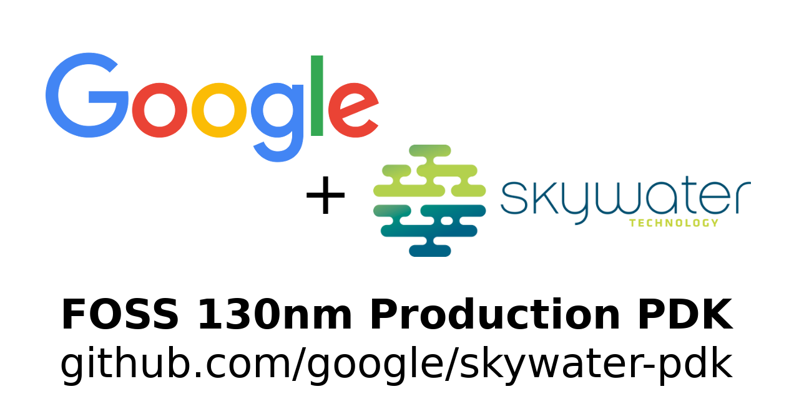

# Physical Verification using SKY130


A 5 day cloud based virtual training workshop conducted by VSD-IAT from 11<sup>th</sup> to 15<sup>th</sup> August. The link to the workshop webpage can be found [here](https://www.vlsisystemdesign.com/physical-verification-using-sky130/). Below is a brief, day-wise documentation about the topics covered in the course, along with my implementations of the lab sessions.

## Table of Contents


## Day 1 - Introduction to SkyWater SKY130 and Open-Source EDA Tools

### SkyWater PDK

The SkyWater Open Source PDK is a joint project between Google and the SkyWater Technology Foundry, which provides a fully open source Process Design Kit (PDK), and its related resources. The SkyWater open PDK public repository contains the following:
 - [Documentation](https://skywater-pdk.rtfd.io/) 
 - [PDK Library and files](https://github.com/google/skywater-pdk)
 - as well as the [Community](https://join.skywater.tools/)
 
 
 
The "130" in SKY130 stands for the feature size, which is the length of smallest transistor that can be manufactured in the process.

### Open-Source EDA Tools

Open_PDKs is a Makefile based installer that takes files from the SkyWater PDKs and reformats them for a number of open source EDA tools, which can be found at [R. Timothy Edwards' github page](https://github.com/RTimothyEdwards/open_pdks).

Tools currently supported by open_pdks:
- Magic
- Klayout
- Openlane
- Xschem
- Netgen
- Ngspice
- IVerilog
- qflow
- IRSIM
- xcircuit

To install SKY130 PDKs, we must clone the repository and specify the process to compile and install using the following commands.

```
git clone https://github.com/RTimothyEdwards/open_pdks
cd open_pdks
configure --enable-sky130-pdk
make
sudo make install
```

The ```make``` process grabs the SKY130 repository and submodules, as well as a few third party repositories to use in the install. It then builds the libraries from these various repositories.

The libraries supported by open_pdks are:
- Digital standard cells (ex: sky130_fd_sc_hd)
- Primitive devices/analog (ex: sky130_fd_pr)
- I/O cells (ex: sky130_fd_io)
- 3rd party libraries (ex: sky130_ml_xx_hd)

Open_PDKs uses a common installed filesystem structure, where the SkyWater PDKs are placed under the directory ```/usr/share/pdk/sky130A/```. Under this main SK130 PDK directory, are 2 subdirectories ```libs.tech```, which contains all subdirectories for the open source tool setups, and ```libs.ref```, which contains the reference libraries in various formats. The project directory follows a similar format, with a ```project_root/``` directory containing subdirectories for each tool or flow needed.

### Physical Verification and Design Flows

Like functional verification, where we check if the voltages, signals and timings match the specification; physical verification is to check whether you have a mask layout that matches what you think the circuit should be.
